# 1

下列哪个是 JDK 提供的编译器____B_____。
A. java.exe B. javac.exe C. javap.exe D. javaw.exe

- A. java.exe - 该命令用于运行Java应用程序。
- B. javac.exe。JDK（Java Development Kit）提供了javac.exe作为Java源代码的编译器。
  通过运行javac命令，可以将Java源代码文件编译成字节码文件，以便在Java虚拟机上运行。
- C. javap.exe - 该命令用于反编译class文件，以查看类的详细信息。
- D. javaw.exe - 该命令也用于运行Java应用程序，通常用于GUI程序，它会在没有控制台窗口的情况下运行Java应用程序。

##### 样例

A. java.exe:

```
java HelloWorld
```

这将运行名为HelloWorld的Java应用程序。

B. javac.exe:

```
javac HelloWorld.java
```

这将编译名为HelloWorld.java的Java源文件。

C. javap.exe:

```
javap -c HelloWorld
```

这将反编译名为HelloWorld的class文件，并显示它的字节码。

D. javaw.exe:

```
javaw HelloWorld
```

这将以无控制台窗口的方式运行名为HelloWorld的Java应用程序，通常用于GUI程序。

简单来说，就是javac将编写的java代码编译成类的源文件，java运行此文件执行，javap可以将源文件反编译，
而javaw可以在运行时不创建控制台。

# 2

下面哪个是用 Java 编写的以 Web 服务器为容器的服务器端程序____C_____。
A. Java 应用程序 B. Applet C. Servlet D. Javabean

Servlet是用Java编写的服务器端程序，通常以Web服务器为容器。它们能够接收来自客户端（通常是Web浏览器）的请求，并生成响应。Servlet通常通过HTTP协议与客户端进行通信，因此它们广泛用于开发基于Web的应用程序。

Servlet程序运行在Servlet容器中，这个容器负责管理Servlet的生命周期、线程安全性和其他方面的细节。常见的Servlet容器包括Tomcat、Jetty和GlassFish等。在客户端发送请求时，Servlet容器会调用适当的Servlet来处理请求并生成响应，然后将响应返回给客户端。

相对而言：
A. Java 应用程序通常是独立的应用程序，不依赖于Web服务器。
B. Applet是嵌入到网页中的小型Java程序，用于在客户端执行，但由于安全性和性能问题，已经逐渐被废弃。
D. Javabean是一种可重用的Java组件，通常用于构建用户界面。它们通常不直接用作服务器端程序。

当提及Applet和JavaBean时，以下是它们的基本使用示例：

Applet使用示例：

```java
import java.applet.Applet;
import java.awt.Graphics;

public class HelloWorldApplet extends Applet {
    public void paint(Graphics g) {
        g.drawString("Hello, World!", 20, 20);
    }
}
```

在HTML页面中，可以通过以下方式嵌入Applet：

```html

<applet code="HelloWorldApplet.class" width="200" height="60">
</applet>
```

JavaBean使用示例：

```java
public class PersonBean {
    private String name;
    private int age;

    // 必须有无参构造方法
    public PersonBean() {
    }

    // 属性访问方法
    public String getName() {
        return name;
    }

    public void setName(String name) {
        this.name = name;
    }

    public int getAge() {
        return age;
    }

    public void setAge(int age) {
        this.age = age;
    }
}
```

在其他Java类中可以使用JavaBean：

```java
public class Main {
    public static void main(String[] args) {
        PersonBean person = new PersonBean();
        person.setName("Alice");
        person.setAge(25);
        System.out.println(person.getName() + " is " + person.getAge() + " years old.");
    }
}
```

需要注意的是，随着技术的发展，Applet已经逐渐被废弃，而JavaBean则更多地被用于构建企业级应用程序中的组件。

JavaBean是一种可重用的软件组件，它是用Java编写的类，遵循特定的约定，可以在各种Java开发环境中使用。JavaBean通常用于构建可视化用户界面（如Swing）或企业级Java应用程序。

JavaBean的特点包括：

1. 遵循特定约定：JavaBean类必须遵循特定的命名约定和方法签名，以便在各种开发工具中进行识别和操作。
2. 可重用性：JavaBean被设计为可重用的组件，可以在不同的应用程序中使用，从而提高代码的复用性和可维护性。
3. 封装性：JavaBean通过封装数据和行为来实现对成员变量的访问控制，提供了更好的安全性和灵活性。
4. 事件支持：JavaBean可以通过事件机制来向外部组件通知自身状态的变化，从而实现与其他组件的交互。
5. 序列化支持：JavaBean可以被序列化为字节流，以便在网络上传输或永久存储。

通常，一个JavaBean类具有以下特征：

- 公共的无参构造方法
- 私有的成员变量
- 公共的getter和setter方法用于对成员变量的访问和修改

JavaBean广泛应用于图形用户界面开发、企业级应用程序开发以及Web开发中，例如在JSP页面中使用JavaBean来处理业务逻辑。

# 3

如果 JDK 安装的路径为“c\java”，若想在命令窗口中任何当前路径下都可以
直接使用 java 命令，需要将环境变量 path 设置为_____B____。
A. c:\java B. c:\java\bin C. c:\jre\bin D. c:\java\lib

JDK（Java开发工具包）安装目录通常包含以下几个重要的子目录：

1. **bin目录**：包含了许多关键的可执行文件，比如java、javac等。这些文件是用于编译、运行Java程序的工具。

2. **jre目录**：Java运行时环境（JRE）的根目录。它包含了JRE的各种文件，包括库文件、支持文件和JRE可执行文件。

3. **lib目录**：包含了Java标准库和其他扩展库的JAR文件。这些库文件对于Java程序的开发和运行非常重要。

4. **include目录**：包含了用于本地方法开发（如使用JNI）所需的头文件。

5. **src.zip文件**：这是JDK的源代码压缩包，其中包含了Java标准库的源代码。这对于学习和调试非常有用。

这些目录和文件共同构成了JDK的核心内容，使得开发人员能够编写、编译和运行Java程序。在配置环境变量时，通常需要将bin目录添加到系统的环境变量path中，以便系统可以在任何路径下找到并执行Java相关的命令。

# 4

下面哪个语句会引起编译错误_____C_____。
A. int a=10; B. short b=2; C. float c=10.5; D. double d=12.8;

**java中带小数点的数值默认为double型，想要赋值float必须在后面加上f，例如10.5f**

# 5

.下面哪个是最早的面向对象语言___D_______。
A. C++ B. Smalltalk C. Java D. Simula 67

当谈到C++、Smalltalk、Java和Simula 67时，我们可以简要地描述它们的特点和发展历程：

1. **C++**：
    - C++是一种通用编程语言，是C语言的扩展。它在C语言的基础上增加了面向对象编程（OOP）的特性，比如类和对象。
    - C++支持面向对象编程、泛型编程和过程式编程，具有高效性和灵活性。
    - C++由Bjarne Stroustrup在1983年首次发布，目前被广泛应用于系统软件、游戏开发、嵌入式系统等领域。

2. **Smalltalk**：
    - Smalltalk是一种纯粹的面向对象编程语言，一切皆为对象。它具有强大的动态特性，支持灵活的对象交互和动态类型。
    - Smalltalk最早由Alan Kay、Adele Goldberg等人在1970s开发，并于1972年首次发布。它对后来的面向对象语言产生了深远影响。

3. **Java**：
    - Java是一种跨平台的面向对象编程语言，被设计用于具有高度移植性的应用程序开发。
    - Java最初由Sun Microsystems开发，1995年首次发布。它吸收了C++的许多概念，并添加了自动内存管理和垃圾回收等功能。
    - Java在客户端应用、企业软件、移动应用和大型系统中都有广泛应用。

4. **Simula 67**：
    - Simula 67被认为是第一个面向对象编程语言，它引入了类、对象、继承、多态等概念。
    - Simula最早由Ole-Johan Dahl和Kristen Nygaard在1960s开发，被视为面向对象编程的奠基之作。其影响深远，影响了后来的面向对象编程语言的设计和发展。

这四种语言各自具有独特的特点和发展历史，对计算机编程和软件开发产生了深远影响。

# 6

下面哪个不是类之间的关系____A_______。
A. 实例化 B. 关联 C. 继承 D. 依赖

正确答案是 A. 实例化。实例化并不是类之间的关系，而是创建一个类的实例，也就是根据类创建一个对象。关联、继承和依赖是类之间常见的关系：

- **关联**：表示两个类之间有某种连接，其中一个类的对象可以使用另一个类的对象。
- **继承**：表示一个类可以从另一个类继承属性和行为，子类可以重用父类的特性。
- **依赖**：表示一个类需要另一个类的协助，通常表现为一个类作为参数传递给另一个类的方法。

因此，实例化并不是类之间的关系，而是创建对象的过程。

当谈论类之间的关系时，我们可以通过具体的例子来说明不同的关系。

1. **关联**：
    - 一个学校（School）类和一个教师（Teacher）类之间可能存在关联关系。教师对象可能属于某个学校，因此在学校类中可能会有一个教师对象的列表，表示学校和教师之间的关联关系。

2. **继承**：
    - 一个动物（Animal）类和一个猫（Cat）类之间可能存在继承关系。猫类可以继承动物类的属性和行为，比如动物类有“呼吸”和“移动”方法，而猫类可以继承这些方法并且添加自己的特有行为，比如“发出喵喵声”。

3. **依赖**：
    - 一个订单（Order）类可能依赖于一个支付方式（Payment）类。在订单类中可能有一个接受支付的方法，这个方法需要使用支付方式类的对象来完成订单支付，因此订单类依赖于支付方式类。

这些例子可以帮助理解类之间的关系以及这些关系在实际编程中的应用。

# 7

在以下什么情况下，构造方法会被调用_____B_______。
A. 类定义时 B. 创建对象时
C. 调用对象方法时 D. 使用对象的变量时

没啥好说的，选B

# 8

8.在 Outer 类中定义一个非静态成员类 Inner，需要在 main()方法中创建 Inner 类
实例对象，以下四种方式哪一种是正确的______A_____。

A. Inner in = new Inner();

B. Inner in = new Outer.Inner();

C. Outer.Inner in = new Outer.Inner();

D. Outer.Inner in = new Outer().new.Inner();

写法可以是：
Inner in = new Inner();
或者
Outer.Inner in = new Outer.new Inner();
，也可以部分拼接

四种子类：
https://www.joshua317.com/article/212
https://www.cnblogs.com/yz123/p/11962473.html
接口：
https://javabetter.cn/oo/interface.html#_01%E3%80%81%E5%AE%9A%E4%B9%89%E6%8E%A5%E5%8F%A3

## 成员内部类:

相当于成员变量

```java
class Outer { // 外部类
    private String name;

    public static void main(String[] args) {
        Outer outerObj = new Outer("joshua317");
        Outer.Inner inner = outerObj.new Inner();
        //Outer.Inner inner = new Outer.new Inner();
        inner.InnerFun1();
    }

    public Outer(String name) {
        this.name = name;
    }

    public void OuterFun1() {
        System.out.println("外部类成员方法");
    }

    class Inner { // 内部类
        public void InnerFun1() {
            System.out.println(name);
        }
    }
}

```

调用方法

在 Java 中，内部类实例化的语法是通过外部类的对象调用 `new` 关键字来创建内部类的对象。这是因为内部类对象与外部类对象有着密切的关联，内部类需要一个外部类的实例作为上下文来存在。

当你使用 `outerObj.new Inner()` 这样的语法时，你其实是告诉编译器要创建外部类 `Outer` 的内部类 `Inner`
的一个新实例，并且这个实例将会和 `outerObj` 相关联。

这种语法反映了内部类的特殊性：它依赖于外部类的实例存在，并且内部类实例始终会隐式地持有一个指向外部类实例的引用。因此，在实例化内部类的时候，需要通过外部类的实例来做到这一点。

当成员内部类拥有和外部类同名的成员变量或者方法时，会根据就近原则，即默认情况下访问的是成员内部类的成员。如果要访问外部类的同名成员，需要以下面的形式进行访问：

外部类.this.成员变量
外部类.this.成员方法

## 局部内部类

相当于局部变量

局部内部类是定义在一个方法或者一个作用域里面的类，它和成员内部类的区别在于局部内部类的访问仅限于方法内或者该作用域内。

局部内部类语法格式：

```java


public class Outer {//外部类

    public void OuterFun1() {
        System.out.println("外部类成员方法");
        class Inner {//局部内部类

        }
    }
}
```

## 匿名内部类

https://www.cnblogs.com/nerxious/archive/2013/01/25/2876489.html

```java
public class Outer { // 外部类

    public static void main(String[] args) {

        /**
         * 底层会分配一个类名Outer$1,去实现Inner接口 class Outer$1 implements Inner { @Override public void
         * innerFun1() { System.out.println("实现接口Inner，匿名内部类方法innerFun1()"); } }
         */
        Inner inner =
                new Inner() {
                    @Override
                    public void innerFun1() {
                        System.out.println("实现接口Inner，匿名内部类方法innerFun1()");
                    }
                };
        System.out.println(inner);
        inner.innerFun1();
        // 只有在匿名内部类这里可以将接口直接实例化
        /**
         * 底层会分配一个类名Outer$2，去继承InnerClass class Outer$1 extends InnerClass { @Override public void
         * innerFun1() { System.out.println("匿名类继承了 InnerClass 类，匿名内部类方法innerFun1()"); } }
         */
        Inner inner2 =
                new InnerClass() {
                    @Override
                    public void innerFun1() {
                        System.out.println("匿名类继承了 InnerClass 类，匿名内部类方法innerFun1()");
                    }
                };
        System.out.println(inner2);
        inner2.innerFun1();
    }
}

class InnerClass implements Inner {
    @Override
    public void innerFun1() {
    }
}

interface Inner {
    public void innerFun1();
}

```

可以类比类的实例化

```java
Object object=new Object();
```

在这里可以在后面追加{}，就可以临时更改Object内部的成员属性

## 静态内部类

```java
public class Outer { // 外部类
    static String name = "joshua317";

    public static void main(String[] args) {
        Outer outer = new Outer();
        // 方式一：内部直接访问
        Inner inner1 = new Inner();
        inner1.innerFun();
        // 方式二：因为是静态内部类，可以通过类名直接访问(前提是满足访问权限)
        Outer.Inner inner2 = new Outer.Inner();
        inner2.innerFun();
        // 方式三：通过普通成员方法，返回静态内部类的实例
        Inner inner3 = outer.getInnerInstance();
        inner3.innerFun();
        // 方式三：通过静态方法，返回静态内部类的实例
        Outer.Inner inner4 = Outer.getInnerInstance2();
        inner4.innerFun();
    }

    static class Inner { // 内部类
        static String name = "joshua317-inner";

        public void innerFun() {
            System.out.println("内部类静态成员" + name + "  外部类静态成员" + Outer.name);
        }
    }

    /**
     * 通过方法，返回静态内部类的实例
     *
     * @return Inner
     */
    public Inner getInnerInstance() {
        return new Inner();
    }

    public static Inner getInnerInstance2() {
        return new Inner();
    }
}

```

# 9

Point 是用户自定义的一个类，下面哪个语句是错误的____B_______。
A. Object[] P=new Point[10];
B. Point P[]=new Object[10];
C. Point P[]={new Point(), new Point()};
D. Point P[][]=new Point[10][];

这个语句试图创建一个 Point 类型的数组，但指定的数组类型是 Object。在Java中，数组会在运行时强制检查元素的类型，以确保类型安全。由于
Object 是所有类的父类，所以可以将任何类的对象存储在 Object 数组中，但不能将一个 Object 数组赋值给一个具体类的数组。

# 10

类中的一个成员方法被下面哪个修饰符修饰时，只能在本类中被使用_C___。
A. public B. protected C. private D. default

在Java中，default（或称为
package-private）是一种访问修饰符，它表示成员（类、变量、方法等）对同一包中的其他类可见，但对于不在同一包中的类是不可见的。如果不指定任何访问修饰符，默认情况下，成员就会被视为具有
default 访问权限。

这意味着当你使用 default 修饰符时，被修饰的成员只能在同一个包中被访问，而无法被其他包中的类访问。这样可以控制成员的访问范围，使得一些实现细节对外部包隐藏起来，从而提高了代码的安全性和封装性。

举个例子，假设有一个类 `MyClass`，其中有一个方法使用了 default 访问修饰符：

```java
package com.example;

public class MyClass {
    void myMethod() {
        // 方法实现
    }
}
```

在同一个包中的其他类可以访问 `MyClass` 的 `myMethod()` 方法，例如：

```java
package com.example;

public class AnotherClass {
    public void anotherMethod() {
        MyClass obj = new MyClass();
        obj.myMethod();  // 可以访问 myMethod()
    }
}
```

然而，如果 `AnotherClass` 类不在 `com.example` 包中，那么它将无法访问 `MyClass` 的 `myMethod()` 方法。

总之，default 修饰符提供了一种限制成员访问范围的方式，它使得同一包中的类可以访问，而其他包中的类不能访问被 default 修饰的成员。

# 11

在 Java 中要想让一个类继承另一个类，可以使用以下哪个关键字_C____。
A. inherits B. implements C. extends D. super
A啥也不是，不是关键字 ，super可以用来调用父类的相关属性

# 12

如果想让一个类中的方法不能被其子类重写，需要使用关键字____B______。
A. static B. final C. transient D. abstract

transient的用法：
https://www.cnblogs.com/lanxuezaipiao/p/3369962.html

# 13

.以下哪个关键字用于在方法上声明抛出异常____D______。
A. try B. catch C. finally D. throws

try 和catch是在方法内部的，在过程执行逻辑上进行抛出的

# 14

.已知类的继承关系如下：
class Employee{};
class Manager extends Employee{};
class Director extends Employee{};
则以下语句能通过编译的是___D______。
A. Employee e=new Manager(); B. Director d=new Manager();
C. Director d=new Employee(); D. Manager m=new Director();

这题答案错了，选A

# 15

.JFrame 默认的布局管理器是____B_____。
A. FlowLayout B. BorderLayout C. GridLayout D. BoxLayout

当我们使用不同的布局管理器时，可以通过简单的示例来展示它们的不同效果。以下是四种常见的布局管理器以及它们的含义、作用和代码示例：

1. FlowLayout（流式布局）:
    - 含义和作用：FlowLayout 是一种简单的布局管理器，它按照从左到右、从上到下的顺序排列组件。当一行放不下时，会自动换行。它适合用于需要依次排列组件的简单界面。
    - 代码样例：

   ```java
   import javax.swing.*;
   import java.awt.*;

   public class FlowLayoutExample {
       public static void main(String[] args) {
           JFrame frame = new JFrame("FlowLayout Example");
           frame.setLayout(new FlowLayout());

           frame.add(new JButton("Button 1"));
           frame.add(new JButton("Button 2"));
           frame.add(new JButton("Button 3"));

           frame.setSize(300, 200);
           frame.setDefaultCloseOperation(JFrame.EXIT_ON_CLOSE);
           frame.setVisible(true);
       }
   }
   ```

`frame.setDefaultCloseOperation(JFrame.EXIT_ON_CLOSE)` 是设置 JFrame 窗口的默认关闭操作。`JFrame.EXIT_ON_CLOSE`
是一个常量，表示在关闭窗口时退出应用程序。

当调用 `setDefaultCloseOperation(JFrame.EXIT_ON_CLOSE)`
后，关闭窗口的操作将会终止应用程序的运行，即关闭窗口时应用程序将被完全关闭。这是一种常见的设置，通常用于主要的顶级窗口，比如应用程序的主窗口。

另外，还有其他可选的关闭操作参数可以传递给 `setDefaultCloseOperation()` 方法，例如：

- `JFrame.HIDE_ON_CLOSE`：关闭窗口时隐藏窗口，但不终止应用程序的运行。
- `JFrame.DISPOSE_ON_CLOSE`：关闭窗口时释放窗口占用的资源，但不终止应用程序的运行。

这些参数可以根据需要进行选择，以实现特定的关闭行为和应用程序逻辑。

2. BorderLayout（边界布局）:
    - 含义和作用：BorderLayout 将容器分为东、西、南、北、中五个区域，每个区域只能放置一个组件。通常用于设计具有明确定位的界面，比如主界面中的各个部分。
    - 代码样例：

   ```java
   import javax.swing.*;
   import java.awt.*;

   public class BorderLayoutExample {
       public static void main(String[] args) {
           JFrame frame = new JFrame("BorderLayout Example");
           frame.setLayout(new BorderLayout());

           frame.add(new JButton("North"), BorderLayout.NORTH);
           frame.add(new JButton("South"), BorderLayout.SOUTH);
           frame.add(new JButton("East"), BorderLayout.EAST);
           frame.add(new JButton("West"), BorderLayout.WEST);
           frame.add(new JButton("Center"), BorderLayout.CENTER);

           frame.setSize(300, 200);
           frame.setDefaultCloseOperation(JFrame.EXIT_ON_CLOSE);
           frame.setVisible(true);
       }
   }
   ```

3. GridLayout（网格布局）:
    - 含义和作用：GridLayout 将容器划分为固定行数和列数的网格，每个单元格可以放置一个组件。它适合用于将组件按照网格形式排列的界面，比如游戏棋盘。
    - 代码样例：

   ```java
   import javax.swing.*;
   import java.awt.*;

   public class GridLayoutExample {
       public static void main(String[] args) {
           JFrame frame = new JFrame("GridLayout Example");
           frame.setLayout(new GridLayout(2, 3));//设置了 JFrame 的布局管理器为 GridLayout，且指定了网格布局的行数为 2，列数为 3。

           frame.add(new JButton("Button 1"));
           frame.add(new JButton("Button 2"));
           frame.add(new JButton("Button 3"));
           frame.add(new JButton("Button 4"));
           frame.add(new JButton("Button 5"));
           frame.add(new JButton("Button 6"));

           frame.setSize(300, 200);
           frame.setDefaultCloseOperation(JFrame.EXIT_ON_CLOSE);
           frame.setVisible(true);
       }
   }
   ```

4. BoxLayout（盒式布局）:
    - 含义和作用：BoxLayout 沿着一个方向（水平或垂直）依次排列所有组件，并可以指定组件的对齐方式。它适合用于需要灵活地控制组件在一个方向上的排列方式的界面。
    - 代码样例：

   ```java
   import javax.swing.*;
   import java.awt.*;

   public class BoxLayoutExample {
       public static void main(String[] args) {
           JFrame frame = new JFrame("BoxLayout Example");
           frame.setLayout(new BoxLayout(frame.getContentPane(), BoxLayout.Y_AXIS));

           frame.add(new JButton("Button 1"));
           frame.add(Box.createVerticalStrut(10)); // 加入一些空白
           frame.add(new JButton("Button 2"));
           frame.add(Box.createVerticalGlue());   // 自动填充剩余空间
           frame.add(new JButton("Button 3"));

           frame.setSize(200, 300);
           frame.setDefaultCloseOperation(JFrame.EXIT_ON_CLOSE);
           frame.setVisible(true);
       }
   }
   ```

`frame.getContentPane()` 是一个方法调用，用于获取 JFrame 的内容面板（content pane）。内容面板是 JFrame 中的一个容器，用于存放添加到窗口中的组件。

在 Java Swing 中，JFrame 是顶级容器，而内容面板是位于 JFrame 内部的一个容器。内容面板可以通过 `getContentPane()` 方法来获取。

通常情况下，我们会将组件添加到内容面板中，而不是直接添加到 JFrame 中。这是因为内容面板可以提供更好的布局和组件管理功能，而
JFrame 则负责显示内容面板以及处理窗口相关的特性，如标题栏、边框等。

使用 `frame.getContentPane()` 可以获取到内容面板对象，然后对该对象进行设置布局、添加组件等操作，以实现窗口中内容的定制和排列。

`BoxLayout.Y_AXIS` 是 BoxLayout 类的一个静态常量，用于表示在 BoxLayout 中沿着 Y 轴（垂直方向）排列组件。

当我们使用 `BoxLayout` 布局管理器时，可以通过指定 `BoxLayout.Y_AXIS` 或 `BoxLayout.X_AXIS`
来指定组件的排列方向。在这里，`BoxLayout.Y_AXIS` 表示组件将按照垂直方向依次排列。

这种灵活的方式使得我们可以根据需要在水平或垂直方向上排列组件，并且可以很方便地控制组件之间的间距和填充，使得界面布局更加灵活和符合设计要求。

通过这些代码示例，你可以清晰地了解不同布局管理器的含义、作用以及如何在实际代码中使用它们来实现特定的界面布局效果。

# 16

以下哪个是 FileOutputStream 的父类____C______。
A. File B. FileOutput C. OutputStream D. InputStream

InputStream 和 OutputStream 是 Java 中用于处理字节流的抽象类。

- **InputStream** 是所有字节输入流的超类，它定义了读取字节的基本方法。它是一个抽象类，不能被实例化，但有许多具体的子类，比如
  FileInputStream 等，用于从各种数据源中读取字节数据。

- **OutputStream** 是所有字节输出流的超类，它定义了写出字节的基本方法。同样也是一个抽象类，不能被实例化，但有许多具体的子类，比如
  FileOutputStream 等，用于向各种目的地写出字节数据。

这两个类在 Java 的 I/O
操作中起着非常重要的作用，它们为字节流提供了统一的接口和基本的操作方法，使得我们可以方便地进行字节数据的读取和写入操作。通过这些类，我们可以处理文件、网络连接、内存缓冲区等各种数据源，实现非常灵活和高效的字节级别的
I/O 操作。

# 17

可以读取 int、float 等类型数据的数据流是_____C____。
A. FileInputStream B. FilterInputStream
C. DataInputStream D. ObjectInputStream

当使用FilterInputStream，FileInputStream，DataInputStream和ObjectInputStream时，可以根据具体的需求来进行不同的操作。以下是针对每个类的简单示例：

1. 使用FileInputStream读取文件数据：

```java
try{
        FileInputStream fileInput=new FileInputStream("data.txt");
        int data;
        while((data=fileInput.read())!=-1){
        System.out.print((char)data);
        }
        fileInput.close();
        }catch(IOException e){
        e.printStackTrace();
        }
```

直接从文件中读取的二进制数据

2. 使用DataInputStream读取基本数据类型：

```java
try{
        FileInputStream fileInput=new FileInputStream("data.bin");
        DataInputStream dataInput=new DataInputStream(fileInput);
        int intValue=dataInput.readInt();
        double doubleValue=dataInput.readDouble();
        System.out.println("Int value: "+intValue);
        System.out.println("Double value: "+doubleValue);
        dataInput.close();
        }catch(IOException e){
        e.printStackTrace();
        }
```

DataInputStream是Java中的一个输入流类，它继承自FilterInputStream类。DataInputStream的作用是将字节输入流（如FileInputStream）转换为更方便读取基本数据类型的数据流。

具体来说，DataInputStream提供了一组方法来读取不同类型的基本数据类型，如整数、浮点数、字符等。这些方法包括readInt()
、readDouble()、readChar()等。DataInputStream还提供了方法来读取字符串和字节数组。

当你使用FileInputStream读取二进制文件时，数据是以字节的形式存储的。而使用DataInputStream包装FileInputStream后，你可以使用DataInputStream提供的方法方便地读取二进制文件中的基本数据类型的数据，而无需手动解析字节。

例如，当你读取一个整型数据时，使用DataInputStream的readInt()方法会自动从字节流中读取4个字节，并将其解析为一个整数值。这样你就可以直接处理整数数据，而无需手动读取和解析字节。

总之，DataInputStream通过对底层字节流的包装，提供了一组方便读取基本数据类型的方法，简化了从字节流中读取数据的过程。它使得读取二进制文件中的数据变得更加高效和便捷。

3. 使用ObjectInputStream读取对象数据：

```java
try{
        FileInputStream fileInput=new FileInputStream("object.dat");
        ObjectInputStream objectInput=new ObjectInputStream(fileInput);
        MyClass obj=(MyClass)objectInput.readObject();
        System.out.println("Object data: "+obj.toString());
        objectInput.close();
        }catch(IOException|ClassNotFoundException e){
        e.printStackTrace();
        }
```

ObjectInputStream 是 Java 中用于从输入流中读取对象的类。它扩展了 DataInputStream 类，并提供了一种从流中读取对象并将其反序列化为
Java 对象的机制。

当你需要从文件或网络流中读取保存的对象时，ObjectInputStream 可以帮助你将对象的字节表示转换回对象实例。这使得在 Java
程序之间传递对象数据变得更加方便，同时也为对象的持久化和恢复提供了支持。需要注意的是，要求被读取的对象的类必须是可序列化的，即需要实现
Serializable 接口。如果对象所属的类没有实现 Serializable 接口，那么在尝试进行序列化和反序列化时会抛出
NotSerializableException 异常。

序列化：
https://www.runoob.com/java/java-serialization.html

4. 使用FilterInputStream的子类进行包装和过滤：

```java
try{
        FileInputStream fileInput=new FileInputStream("data.txt");
        BufferedInputStream bufferedInput=new BufferedInputStream(fileInput);
        FilterInputStream filterInput=new FilterInputStream(bufferedInput){
        // 这里可以添加自定义的过滤逻辑
        };
        int data;
        while((data=filterInput.read())!=-1){
        System.out.print((char)data);
        }
        filterInput.close();
        }catch(IOException e){
        e.printStackTrace();
        }
```

FilterInputStream 是 Java 中用于提供输入流过滤功能的抽象类。它本身并不直接实现任何具体的输入操作，而是作为其他输入流的包装器，通过对其他输入流进行过滤和处理来提供额外的功能。

FilterInputStream 的子类可以通过重写其方法，以提供不同的过滤行为。例如，BufferedInputStream 就是 FilterInputStream
的一个子类，它提供了输入缓冲功能，可以提高读取性能。

另一个常见的子类是 DataInputStream，它提供了从输入流中读取基本数据类型的功能，如整数、浮点数等。ObjectInputStream 也是
FilterInputStream 的子类，它提供了从输入流中读取对象的功能。

FilterInputStream 本身提供了一些基本的过滤功能，比如 markSupported() 方法用于检查该输入流是否支持标记和重置操作，mark(int
readlimit) 和 reset() 方法用于在流中标记当前位置，并在需要时返回到该位置。

总之，FilterInputStream 为输入流的包装提供了一个灵活的机制，使得我们可以通过组合不同的过滤器来实现各种输入流的组合和功能增强。这种设计符合
Java IO 模型中的装饰器模式，使得输入流的处理变得更加灵活和可扩展。

在这些示例中，我们演示了如何使用FileInputStream、DataInputStream和ObjectInputStream读取文件数据和对象数据，并且展示了如何通过包装和过滤来扩展输入流的功能。这些类提供了丰富的功能和灵活性，可以满足不同场景下的数据读取需求。

https://www.runoob.com/java/java-files-io.html

流阅读器BufferedReader

```java
import java.io.*;

public class BRRead {
    public static void main(String[] args) throws IOException {
        char c;
        // 使用 System.in 创建 BufferedReader
        BufferedReader br = new BufferedReader(new InputStreamReader(System.in));
        System.out.println("输入字符, 按下 'q' 键退出。");
        // 读取字符
        do {
            c = (char) br.read();
            System.out.println(c);
//           str = br.readLine();
//           System.out.println(str);
        } while (c != 'q');
    }
}

```

PrintStream

```java
import java.io.*;

// 演示 System.out.write().
public class WriteDemo {
    public static void main(String[] args) {
        int b;
        b = 'A';
        System.out.write(b);
        System.out.write('\n');
    }
}

```

可以实现向控制台输出的作用，与println效果相同

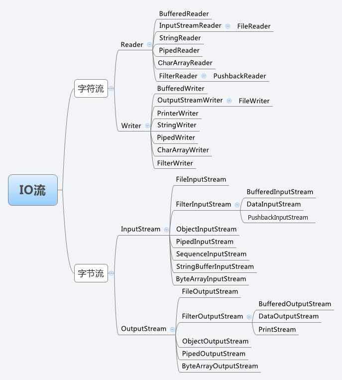

FileInputStream与FileOutputStream

```java
File f=new File("C:/java/hello");
        InputStream in=new FileInputStream(f);
```

ByteArrayOutputStream

```java
import java.io.*;

public class ByteStreamTest {

    public static void main(String args[]) throws IOException {

        ByteArrayOutputStream bOutput = new ByteArrayOutputStream(12);

        while (bOutput.size() != 10) {
            // 获取用户输入值
            bOutput.write(System.in.read());
        }

        byte b[] = bOutput.toByteArray();
        System.out.println("Print the content");
        for (int x = 0; x < b.length; x++) {
            // 打印字符
            System.out.print((char) b[x] + "   ");
        }
        System.out.println("   ");

        int c;

        ByteArrayInputStream bInput = new ByteArrayInputStream(b);

        System.out.println("Converting characters to Upper case ");
        for (int y = 0; y < 1; y++) {
            while ((c = bInput.read()) != -1) {
                System.out.println(Character.toUpperCase((char) c));
            }
            bInput.reset();
        }
    }
}

```

FileOutputStream

```java
File f=new File("C:/java/hello");
        OutputStream fOut=new FileOutputStream(f);
```

使用样例演示代码：

```java
import java.io.*;

public class fileStreamTest {
    public static void main(String[] args) {
        try {
            byte bWrite[] = {11, 21, 3, 40, 5}; // -128~127之间可存储
            OutputStream os = new FileOutputStream("test.txt");
            for (int x = 0; x < bWrite.length; x++) {
                os.write(bWrite[x]); // writes the bytes
            }
            os.close();

            InputStream is = new FileInputStream("test.txt");
            int size = is.available();
            // 它用于返回当前输入流中可读取的字节数。另外，is.available() 方法是一个阻塞方法，如果没有数据可读取，它会一直等待直到有数据可用。因此，在使用
            // is.available() 方法时，要确保输入流中有数据可读取，否则可能会导致程序停滞。

            for (int i = 0; i < size; i++) {
                System.out.print((char) is.read() + "  ");
            }
            is.close();
        } catch (IOException e) {
            System.out.print("Exception");
        }
    }
}

```

# 18

线程调用 sleep()方法后，该线程将进入哪种状态____C_______。
A. 就绪状态 B. 运行状态 C. 阻塞状态 D. 死亡状态

https://www.runoob.com/java/java-multithreading.html

#### 一个线程完整的生命周期

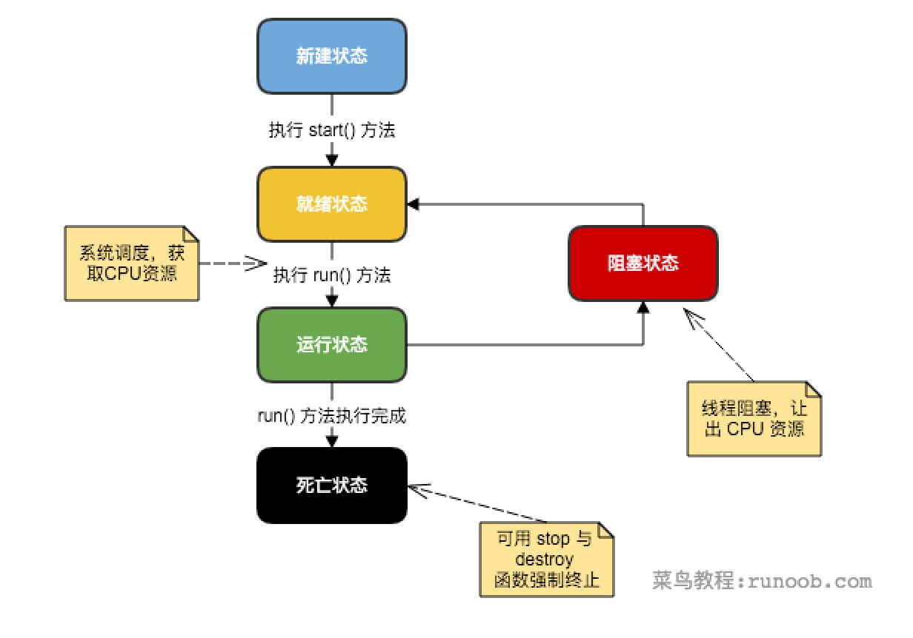

如果一个线程执行了sleep（睡眠）、suspend（挂起）等方法，失去所占用资源之后，该线程就从运行状态进入阻塞状态。在睡眠时间已到或获得设备资源后可以重新进入就绪状态。可以分为三种：

- 等待阻塞：运行状态中的线程执行 wait() 方法，使线程进入到等待阻塞状态。

- 同步阻塞：线程在获取 synchronized 同步锁失败(因为同步锁被其他线程占用)。

- 其他阻塞：通过调用线程的 sleep() 或 join() 发出了 I/O 请求时，线程就会进入到阻塞状态。当sleep() 状态超时，join()
  等待线程终止或超时，或者 I/O 处理完毕，线程重新转入就绪状态。

两种线程写法：

```java
class RunnableDemo implements Runnable {
    private Thread t;
    private String threadName;

    RunnableDemo(String name) {
        threadName = name;
        System.out.println("Creating " + threadName);
    }

    public void run() {
        System.out.println("Running " + threadName);
        try {
            for (int i = 4; i > 0; i--) {
                System.out.println("Thread: " + threadName + ", " + i);
                // 让线程睡眠一会
                Thread.sleep(50);
            }
        } catch (InterruptedException e) {
            System.out.println("Thread " + threadName + " interrupted.");
        }
        System.out.println("Thread " + threadName + " exiting.");
    }

    public void start() {
        System.out.println("Starting " + threadName);
        if (t == null) {
            t = new Thread(this, threadName);
            t.start();
        }
    }
}

public class TestThread {

    public static void main(String args[]) {
        RunnableDemo R1 = new RunnableDemo("Thread-1");
        R1.start();

        RunnableDemo R2 = new RunnableDemo("Thread-2");
        R2.start();
    }
}

```

```java
package ExamTest1.Selection;

class ThreadDemo extends Thread {
   private Thread t;
   private final String threadName;

   ThreadDemo(String name) {
      threadName = name;
      System.out.println("Creating " + threadName);
   }

   public void run() {
      System.out.println("Running " + threadName);
      try {
         for (int i = 4; i > 0; i--) {
            System.out.println("Thread: " + threadName + ", " + i);
            // 让线程睡眠一会
            Thread.sleep(50);
         }
      } catch (InterruptedException e) {
         System.out.println("Thread " + threadName + " interrupted.");
      }
      System.out.println("Thread " + threadName + " exiting.");
   }

   public void start() {
      System.out.println("Starting " + threadName);
      if (t == null) {
         t = new Thread(this, threadName);
         t.start();
      }
   }
}

public class TestThread1 {

   public static void main(String[] args) {
      ThreadDemo T1 = new ThreadDemo("Thread-1");
      T1.start();

      ThreadDemo T2 = new ThreadDemo("Thread-2");
      T2.start();
   }
}

```

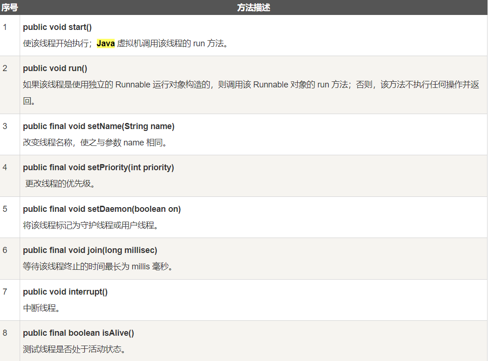
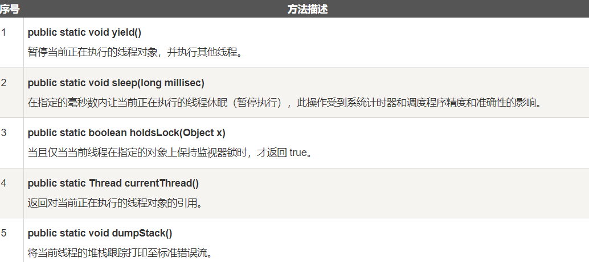

# 19

在 Java 中，使用哪个关键字来保证线程的同步____B______。
A. serializable B. synchronized C. interrupt D. join

简单来讲，_synchronized_ 就是一个只允许一个运行的定义方式

synchronized 是 Java 中用于实现线程同步的关键字。它可以应用于方法或代码块上，用于控制多个线程对共享资源的访问。

当一个线程执行带有 synchronized 关键字修饰的方法或进入 synchronized
代码块时，它会尝试获取对象的锁。如果该锁没有被其他线程占用，则该线程获取到锁并可以执行代码。如果锁已经被其他线程占用，则该线程将被阻塞，直到获取到锁为止。

synchronized 实现了独占锁的机制，即同一时刻只有一个线程能够执行 synchronized
代码块中的代码。这种机制确保了多个线程对共享资源的安全访问，避免了竞态条件和数据不一致的问题。

synchronized 还具有可重入性，即线程可以多次获取同一个对象的锁。在一个线程已经持有锁的情况下，当它再次执行 synchronized
方法或进入 synchronized 代码块时，它仍然可以获取到该对象的锁。

需要注意的是，synchronized 是一种悲观锁，它会导致线程的阻塞和唤醒，可能影响程序的性能。因此，在使用 synchronized
时需要合理地选择同步粒度，避免过多的线程竞争。

总之，synchronized 是 Java 中用于实现线程同步的关键字，通过加锁和解锁操作来控制对共享资源的访问。它提供了一种简单而有效的方式来保证多线程环境下的数据安全性。

当一个账户余额被多个线程同时访问和修改时，可以使用 synchronized 关键字来确保对账户余额的安全操作。

```java
public class BankAccount {
    private int balance;

    public synchronized void deposit(int amount) {
        balance += amount;
    }

    public synchronized void withdraw(int amount) {
        if (balance >= amount) {
            balance -= amount;
        } else {
            System.out.println("Insufficient balance");
        }
    }

    public synchronized int getBalance() {
        return balance;
    }
}

public class Main {
    public static void main(String[] args) {
        BankAccount account = new BankAccount();

        // 创建两个线程进行存款和取款操作
        Thread depositThread =
                new Thread(
                        () -> {
                            account.deposit(100);
                        });

        Thread withdrawThread =
                new Thread(
                        () -> {
                            account.withdraw(50);
                        });

        depositThread.start();
        withdrawThread.start();

        try {
            depositThread.join();
            withdrawThread.join();
            //当一个线程调用另一个线程的join()方法时，它会暂停自己的执行，并等待被调用线程执行完成。也就是说，调用了join()方法的线程会进入阻塞状态，直到被调用线程执行完毕或达到指定的超时时间。
        } catch (InterruptedException e) {
            e.printStackTrace();
        }

        System.out.println("Final balance: " + account.getBalance());
    }
}

```

在上面的例子中，BankAccount 类表示一个银行账户，其中的 deposit、withdraw 和 getBalance 方法都使用了 synchronized
关键字。这样一来，无论是存款还是取款操作，都会在执行时获取 BankAccount
对象的锁，确保同一时刻只有一个线程能够对账户余额进行操作。这样就避免了多个线程同时修改账户余额导致的数据不一致问题。

在 Main 类中，创建了两个线程进行存款和取款操作，并通过 join 方法等待这两个线程执行完毕。最后打印出最终的账户余额。

通过使用 synchronized 关键字，可以保证线程安全地对共享资源进行操作，确保数据的正确性和一致性。


# 20
下面哪个是 Java 提供的面向应用层编程的类_____D_____。
A. InetAddress B.Socket C. URL D. ServerSocket

答案错了，选C
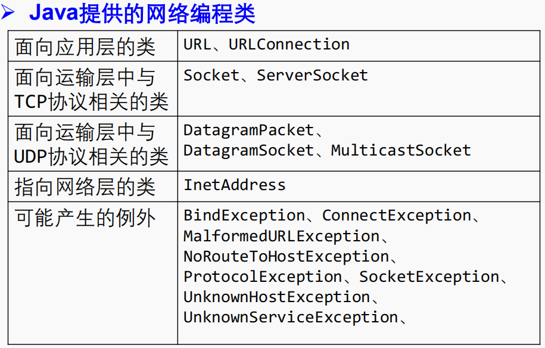
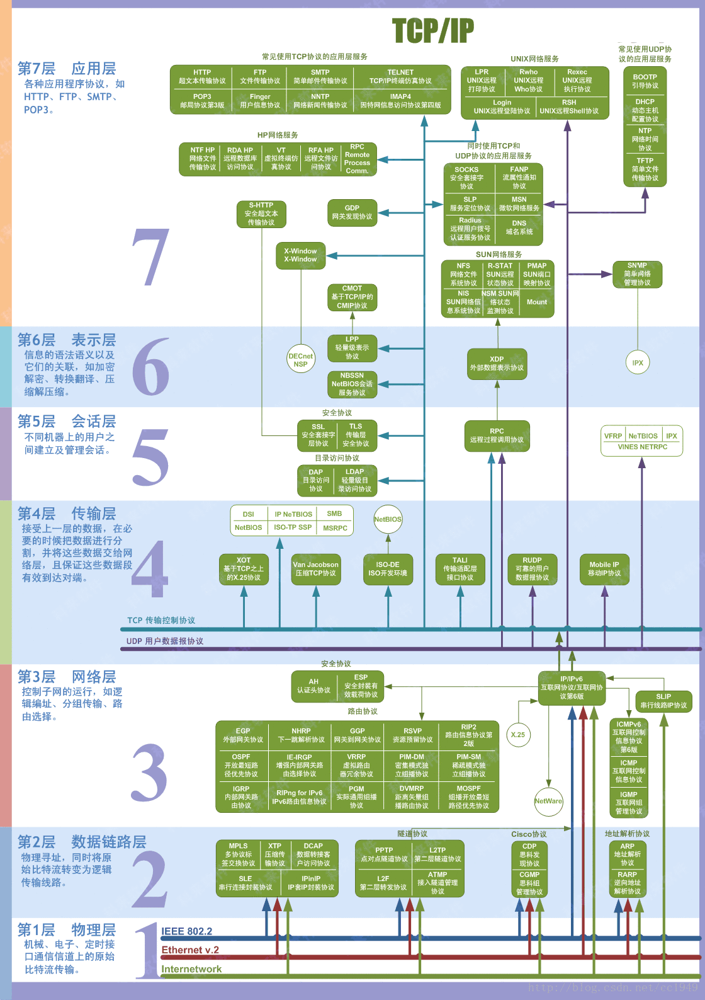

https://blog.csdn.net/dyx1993/article/details/113985648

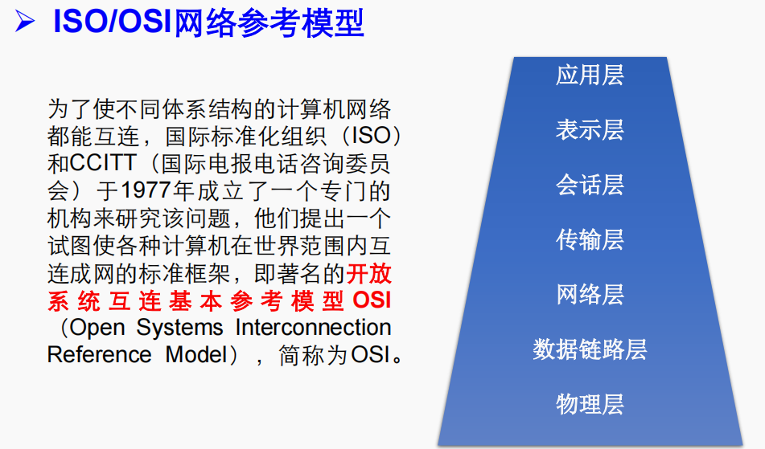
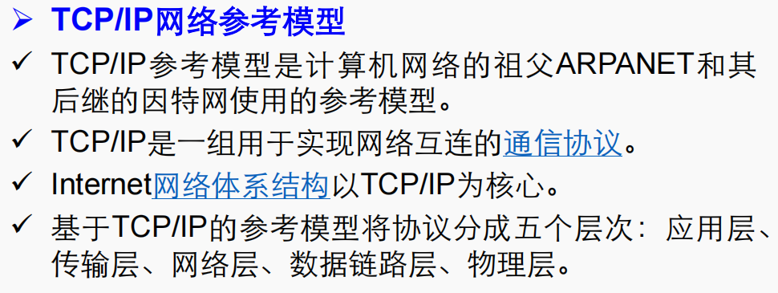
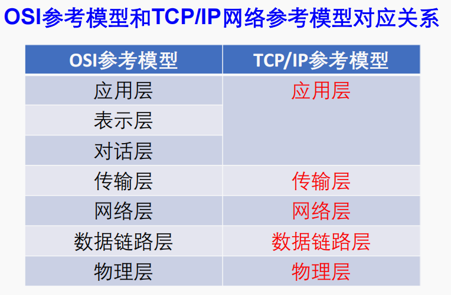
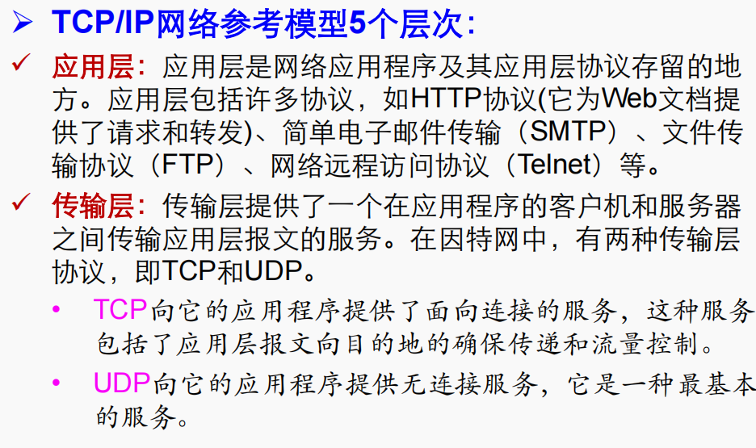

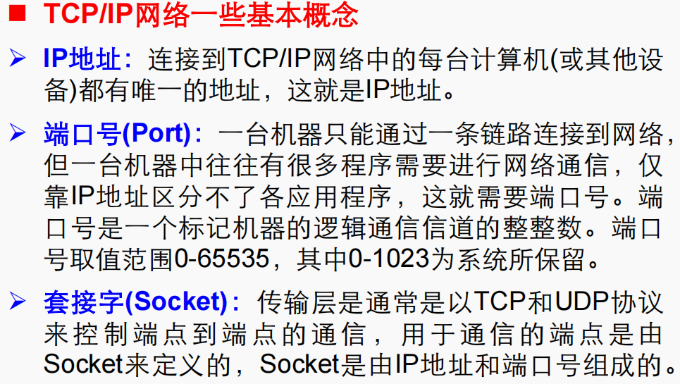
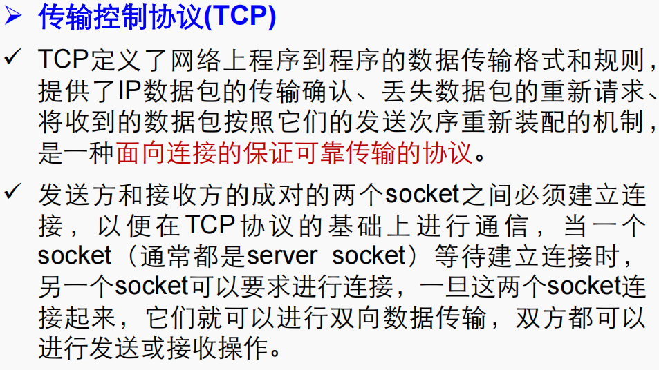
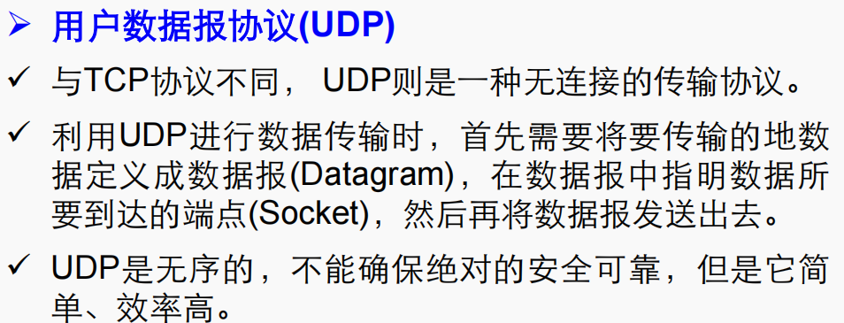


### InetAddress
使用`InetAddress`类，我们可以获取和操作与网络相关的主机名和IP地址。`InetAddress`类提供了一组静态方法和实例方法来获取主机名和IP地址、进行地址解析和反向解析等操作。

下面是一些常用的示例：

1. 获取本地主机的IP地址和主机名：

```java
InetAddress localHost = InetAddress.getLocalHost();
System.out.println("Local Host IP Address: " + localHost.getHostAddress());
System.out.println("Local Host Name: " + localHost.getHostName());
```

2. 根据主机名获取IP地址：

```java
String hostName = "www.example.com";
InetAddress[] addresses = InetAddress.getAllByName(hostName);
for (InetAddress address : addresses) {
    System.out.println("IP Address: " + address.getHostAddress());
}
```
根据主机名获取IP地址返回的是一个数组，是因为一个主机名可能对应多个IP地址。这种情况通常出现在负载均衡、域名解析等情况下。举个例子，当一个域名对应多个服务器时，DNS解析就会返回一个IP地址数组，以提供负载均衡和容错能力。因此，根据主机名获取IP地址返回数组能够更全面地覆盖所有可能的IP地址，确保网络通信的可靠性和稳定性。
3. 根据IP地址获取主机名：

```java
String ipAddress = "192.168.0.1";
InetAddress address = InetAddress.getByName(ipAddress);
System.out.println("Host Name: " + address.getHostName());
```

4. 判断是否可达：

```java
InetAddress address = InetAddress.getByName("www.example.com");
boolean isReachable = address.isReachable(5000); // 5秒内是否可达
System.out.println("Is Reachable: " + isReachable);
```

通过`InetAddress`类，我们可以方便地获取主机名和IP地址，并且可以进行地址解析和网络可达性检查等操作。这使得我们可以在网络编程中更好地处理和使用主机和IP地址相关的信息。


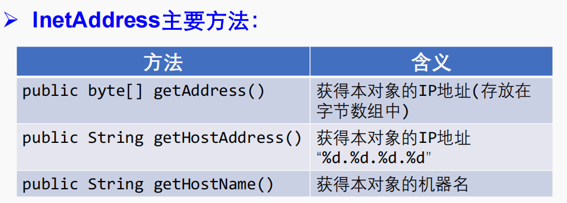

### URL
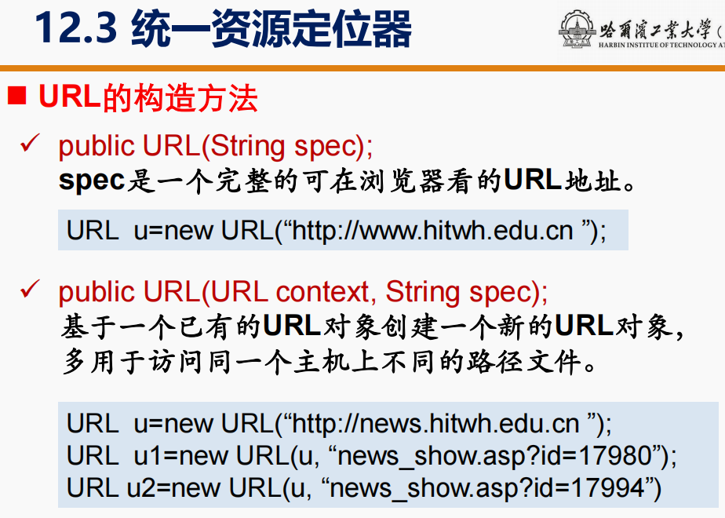
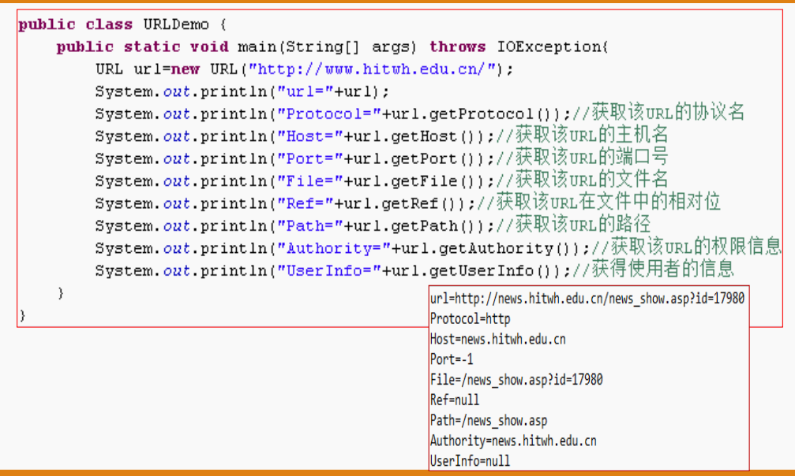
URL与Stream的结合的一个例子，正好可以用来复习
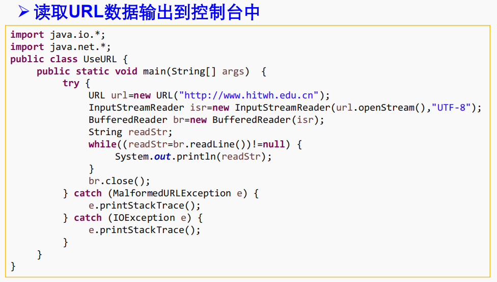
再加上一个线程，正好复习
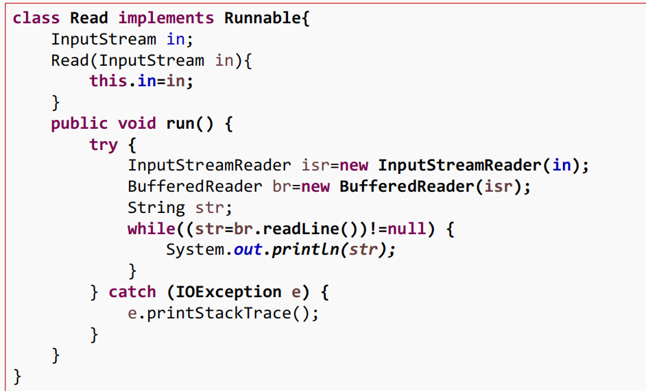


### socket
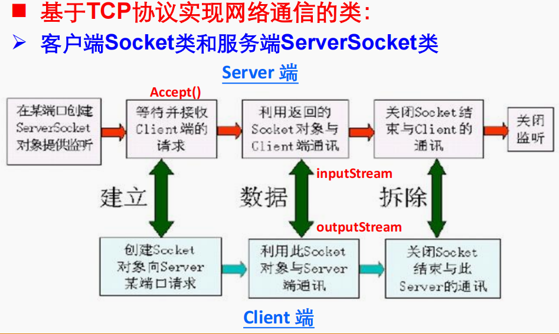
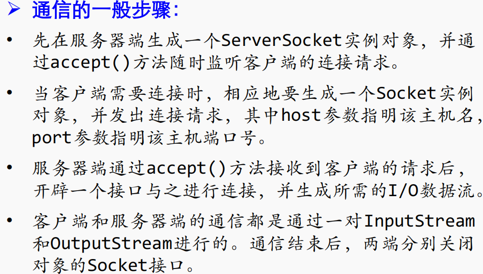

根据你提供的代码，我帮你整理了服务端和客户端的Socket使用样例。在这个例子中，服务端将等待客户端连接，一旦客户端连接成功，服务端将向客户端发送字符串，并从客户端接收数据；客户端将连接到服务端，发送字符串并从服务端接收数据。

服务端代码如下：

```java
import java.io.*;
import java.net.*;

public class SocketServer {
    ServerSocket ss = null;
    Socket socket;
    InputStream in;
    OutputStream out;
    DataInputStream din;
    DataOutputStream dout;

    public SocketServer() {
        try {
            ss = new ServerSocket(10000); // 创建服务器端套接字对象
            System.out.println("等待连接....");
            socket = ss.accept(); // 用accept方法等待客户端的连接
            System.out.println("已连接....");
            in = socket.getInputStream(); // 获取套接字输入流
            out = socket.getOutputStream(); // 获取套接字输出流
            din = new DataInputStream(in);
            dout = new DataOutputStream(out);
            dout.writeUTF("Hello!"); // 向客户端发送字符串

            // 从客户端读取数据
            String name = din.readUTF();
            String department = din.readUTF();
            System.out.println("name=" + name);
            System.out.println("department=" + department);

            // 关闭所有资源
            in.close();
            out.close();
            din.close();
            dout.close();
            socket.close();
            ss.close();
        } catch (IOException e) {
            System.out.println("读写数据出错!" + e);
        }
    }

    public static void main(String[] args) {
        Example.SocketServer socketServer = new Example.SocketServer();
    }
}
```

客户端代码如下：

```java
import java.io.*;
import java.net.*;

public class SocketClient {
    Socket socket;
    InputStream in;
    OutputStream out;
    DataInputStream din;
    DataOutputStream dout;

    public SocketClient() {
        try {
            socket = new Socket("127.0.0.1", 10000); // 创建Socket对象
            in = socket.getInputStream();
            out = socket.getOutputStream();
            din = new DataInputStream(in);
            dout = new DataOutputStream(out);
            din.readUTF();

            // 向服务器发送数据
            dout.writeUTF("孟凡超");
            dout.writeUTF("计算机科学与技术学院");

            in.close();
            out.close();
            din.close();
            dout.close();
        } catch (IOException e) {
            e.printStackTrace();
        }
    }

    public static void main(String[] args) {
        SocketClient socketClient = new SocketClient();
    }
}
```

以上代码演示了一个简单的服务端和客户端的Socket通信样例，服务端与客户端可以相互传递数据。

