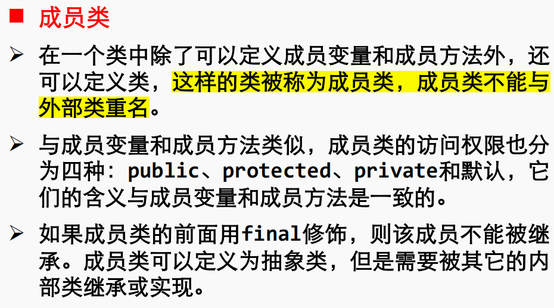
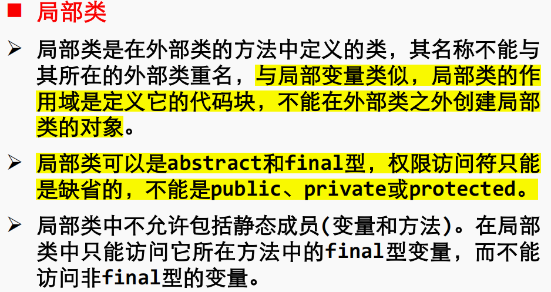
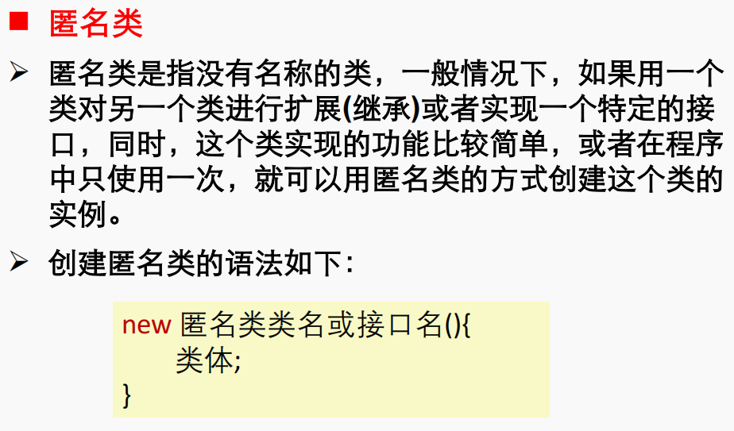
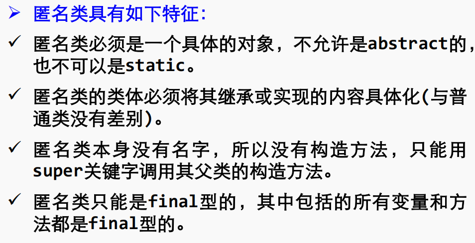

# 1

1.在 Java 中负责对字节代码解释执行的是 _____   B _____。
A. 垃圾回收器 B. 虚拟机 C.编译器 D. Servlet 容器

A. **垃圾回收器 (Garbage Collector):**

- 垃圾回收器是Java运行时环境的一部分，负责管理和释放不再被程序引用的内存。
- 它的主要任务是检测和回收不再使用的对象，以避免内存泄漏。

B. **虚拟机 (Virtual Machine):**

- Java虚拟机（JVM）是Java运行时环境的一部分，负责执行Java字节码。它提供了一个抽象的计算机环境，使得Java程序可以在各种不同的硬件和操作系统上运行。
- JVM解释并执行Java字节码，负责内存管理、垃圾回收、线程管理等。

C. **编译器 (Compiler):**

- 编译器负责将源代码翻译成目标代码，通常是机器码或者中间代码。在Java中，编译器将Java源代码编译成字节码。
- Java编译器将Java源代码转换成字节码文件（.class文件），而不是直接生成本地机器码。

D. **Servlet 容器 (Servlet Container):**

- Servlet容器是用于托管和执行Java Servlet的运行时环境。Servlet是用于构建Web应用程序的Java组件。
- Servlet容器负责解释执行Servlet代码，处理HTTP请求和响应，以及提供Servlet生命周期管理。

在给定的问题中，负责对字节代码解释执行的是Java虚拟机（B）。

# 2

2.下面哪个是嵌入在 HTML 中执行的 Java 程序____B_____。
A. Javabean B. Applet C. Servlet D. Socket

A. **JavaBean:**

- JavaBean 是一种符合特定编程规范的 Java 类，通常被设计用于在可视化开发环境中构建组件化的软件。它是一种可重用的软件组件，具有一些特定的命名约定和属性方法。
- JavaBean 不直接嵌入 HTML 中执行，而是通常在服务器端或其他 Java 应用程序中使用。

B. **Applet（小应用程序）:**

- Applet 是一种嵌入到 HTML 页面中的小型 Java 程序。在客户端浏览器中执行，具有图形用户界面。它使用 `<applet>` 标签将 Java
  小应用程序嵌入到 HTML 页面中，并通过 Java 插件在浏览器中执行。

C. **Servlet:**

- Servlet 是在服务器端执行的 Java 程序，通常用于处理客户端的请求和生成动态的 Web 内容。Servlet 被容器（例如
  Tomcat）管理，它接收来自客户端的请求并生成响应。
- Servlet 不嵌入在 HTML 中，而是在服务器端运行，处理来自客户端的请求。

D. **Socket:**

- Socket 是一种在网络上进行通信的机制，Java 中提供了 Socket 类用于实现网络通信。Socket 使得不同计算机上的程序能够通过网络进行数据交换。
- Socket 不是嵌入在 HTML 中执行的，而是用于处理底层网络通信。

在给定的问题中，嵌入在 HTML 中执行的 Java 程序是 Applet（小应用程序），因此正确的选项是 B。

# 3

3.下面哪个是 Java 的合法标识符_____A____。
A. _number B. interface C. #age D. public

在 Java 中，合法的标识符（Identifier）需要遵循一些规则。合法标识符必须以字母、下划线（_）或美元符号（$）开头，并且后续字符可以是字母、数字、下划线或美元符号。

# 4

4.下面哪个语句会引起编译错误_____C_____。
A. int a[]; B. short[] b; C. float[] c={1.0,2.0}; D. double d[]={1,2};

```java
float[]c={1.0f,2.0f};
```

# 5

5. 在 Java 的类继承关系中，需要遵循以下哪个继承原则_____B_____。
   A. 多重 B. 单一 C. 双重 D. 不能继承

# 6

6.如果类 A 的某个方法的返回类型是类 B，则 A 与 B 之间存在关系__D___。
A. 实例化 B. 关联 C. 继承 D. 依赖

当类 A 的某个方法的返回类型是类 B 时，这表示类 A 依赖于类 B。下面是一个简单的例子：

```java
// 类B
class B {
    public void methodB() {
        System.out.println("Method in class B");
    }
}

// 类A，它依赖于类B
class A {
    public B getInstanceOfB() {
        return new B();
    }
}

// 主程序
public class Example {
    public static void main(String[] args) {
        A instanceOfA = new A();

        // 类A的方法返回了类B的实例
        B instanceOfB = instanceOfA.getInstanceOfB();

        // 调用类B的方法
        instanceOfB.methodB();
    }
}
```

在这个例子中，类 `A` 的方法 `getInstanceOfB` 返回了类 `B` 的一个实例。这表示类 `A` 依赖于类 `B`，因为它使用（依赖于）类 `B`
的实例来执行特定的操作。这种依赖关系在实际的软件设计中很常见，它可以帮助实现代码的模块化和复用。

# 7

7. 如果子类不需要使用从父类继承来的方法功能，可以定义自己的方法，这是
   Java 中的____B______概念。
   A.重载 B.重写 C.继承 D.多态

A. **重载 (Overload):**

- 重载是指在同一个类中，可以定义多个方法，这些方法有相同的名称但具有不同的参数列表（类型或数量不同）。
- 重载的目的是为了提供一种方便的方式来使用相似的操作，具有相同的功能但可以处理不同类型的数据。

B. **重写 (Override):**

- 重写是指在子类中重新定义父类中已有的方法，以提供更具体或特定于子类的实现。
- 重写要求子类方法的签名（名称、返回类型、参数类型）与父类方法的签名相同。

C. **继承 (Inheritance):**

- 继承是指子类获取父类的属性和方法，使得子类能够重用父类的代码。子类可以继承父类的行为，并且可以添加新的行为或修改继承的行为。

D. **多态 (Polymorphism):**

- 多态是指对象可以根据其所属的实际类型以不同的方式呈现相同的接口。在Java中，多态通过方法重写（override）和接口实现实现。
- 多态性允许将不同类型的对象视为相同类型的对象，从而提高了代码的灵活性和可维护性。

在给定的问题中，如果子类不需要使用从父类继承来的方法功能并定义自己的方法，这是 **重写（Override）** 的概念。

多态是面向对象编程中的一个重要概念，它允许不同的对象对同一消息做出响应，使得程序可以在运行时表现出更多的灵活性。多态性主要通过方法重写和接口实现来实现。

### 1. 方法重写（Override）：

方法重写是实现多态的一种方式，它要求子类提供一个与父类相同签名（名称、返回类型、参数类型）的方法。当父类的引用指向子类的对象时，通过这个引用调用的方法实际上是子类中的方法。

```java
class Animal {
    void makeSound() {
        System.out.println("Animal makes a sound");
    }
}

class Dog extends Animal {
    // 重写父类方法
    void makeSound() {
        System.out.println("Dog barks");
    }
}

public class TestPolymorphism {
    public static void main(String[] args) {
        Animal animal = new Dog(); // 父类引用指向子类对象
        animal.makeSound(); // 调用的是子类的方法
    }
}
```

在这个例子中，`Animal` 类有一个 `makeSound` 方法，而 `Dog` 类重写了这个方法。当父类引用 `animal` 指向子类对象 `new Dog()`
时，调用 `makeSound` 方法时实际上执行的是 `Dog` 类中的方法，而不是 `Animal` 类中的方法。

### 2. 接口实现：

多态还可以通过接口实现。一个类可以实现多个接口，从而具有多种形式。在程序中，可以使用接口引用指向实现该接口的类的对象，从而实现多态。

```java
interface Shape {
    void draw();
}

class Circle implements Shape {
    void draw() {
        System.out.println("Drawing a circle");
    }
}

class Rectangle implements Shape {
    void draw() {
        System.out.println("Drawing a rectangle");
    }
}

public class TestPolymorphism {
    public static void main(String[] args) {
        Shape shape1 = new Circle(); // 接口引用指向实现类对象
        Shape shape2 = new Rectangle(); // 接口引用指向实现类对象

        shape1.draw(); // 调用的是 Circle 类的 draw 方法
        shape2.draw(); // 调用的是 Rectangle 类的 draw 方法
    }
}
```

在这个例子中，`Circle` 和 `Rectangle` 类都实现了 `Shape` 接口，可以通过 `Shape` 接口的引用来调用它们的 `draw` 方法，实现了多态。

# 8

8.在 Outer 类中定义一个静态成员类 Inner，需要在 main()方法中创建 Inner 类实
例对象，以下四种方式哪一种是正确的____C_______。
A. Inner in = new Inner();
B. Inner in = new Outer.Inner();
C. Outer.Inner in = new Outer.Inner();
D. Outer.Inner in = new Outer().new.Inner();

## 组合性：



```java
public class EnclosingClass {
    int id;
    String name;
    static int counter = 0;

    public EnclosingClass(int id, String name) {
        this.id = id;
        this.name = name;
        counter++;
    }

    public void print() {
        // Create an instance of the non-static member class internally
        MemberClass mc = new MemberClass();
        mc.print();
    }

    // Non-static member class
    class MemberClass {
        String name;

        public void print() {
            System.out.println(
                    "id="
                            + id
                            + ", name="
                            + EnclosingClass.this
                            .name); // Access the non-static member variable of the enclosing class
            System.out.println(
                    "counter=" + counter); // Access the static member variable of the enclosing class
        }
    }

    public static void main(String[] args) {
        EnclosingClass ec1 = new EnclosingClass(1, "Tom");
        ec1.print();

        EnclosingClass ec2 = new EnclosingClass(2, "John");
        ec2.print();

        EnclosingClass ec3 = new EnclosingClass(3, "Dora");
        EnclosingClass.MemberClass mc =
                ec3.new MemberClass(); // Create an instance of the non-static member class externally
        mc.print();
    }
}

```

```java
public class EnclosingClass1 {
    int id;
    String name;
    static int counter = 0;

    public EnclosingClass1(int id, String name) {
        this.id = id;
        this.name = name;
        counter++;
    }

    public void print() {
        MemberClass mc = new MemberClass(); // Create an instance of static member class internally
        System.out.println("id=" + id + ", name=" + name);
        mc.print();
    }

    // Static member class
    static class MemberClass {
        String name;

        public void print() {
            //System.out.println("id=" + id + ", name=" + EnclosingClass1.this.name);
            // Access the non-static member variable of the enclosing class
            // It seems like there's a commented line of code that's incomplete.

            System.out.println("counter=" + counter);
        }
    }

    public static void main(String[] args) {
        EnclosingClass1 ec1 = new EnclosingClass1(1, "Tom");
        ec1.print();

        EnclosingClass1 ec2 = new EnclosingClass1(2, "John");
        ec2.print();

        EnclosingClass1 ec3 = new EnclosingClass1(3, "Dora");

        EnclosingClass1.MemberClass mc =
                new EnclosingClass1.MemberClass(); // Create an instance of static member class externally
        mc.print();
    }
}

```

- 在这里外部类的print方法可以直接使用成员类进行创建
- 在成员类里进行调用外部对象的同名属性，需要使用：`Outer.this.attribute`
- 在一般情况下，创建外部类的一个成员类的对象写法是： `Outer.Inner inner = new Outer().new Inner()`
- 但是在外部类的里面创建成员类对象的时候写法很简单： `Inner inner = new Inner()`


- 在这里静态成员类不依托外部类对象而独属于外部类本身存在，所以调用的时候不需要创建外部类对象
- 在静态成员类中调用外部类的静态成员属性语法： `attribute`
- 在正常情况下调用外部类的静态成员类创建对象的语法： `Outer.Inner inner = new Outer.Inner()`
- 在外部类的里面创建成员类对象的时候写法很简单： `Inner inner = new Inner()`

> 解释1：对于属性调用，对于 `Outer.this.attribute` ，this指代的是当前的成员类对象本身，它是外部类Outer的一个属性，同样attribute也是this的一个属性

> 解释2：对于创建成员类方法的写法：
> 非静态要先创建外部类对象，在他的基础上再创建内部类对象，而对于静态成员类，可以直接创建，因为他不依托外部类对象存在，素以直接可以new一个，但是要注意他的构造函数是属于外部类，也要使用成员运算符



**定义在方法中：**

```java
public class Outer1 {
    public static void main(String[] args) {
        Outer1 outer1 = new Outer1();
        outer1.print("Hello World!");
    }

    public void print(String s) {
        class Inner {
            private String str;

            private Inner(String str) {
                this.str = str;
            }

            public String getStr() {
                return str;
            }
        }

        System.out.println(new Inner(s).getStr());
    }
}

```

**定义在作用域中：**

```java
public class Outer2 {

    public static void main(String[] args) {
        Outer2 outer = new Outer2();
        outer.print("1");
    }

    public void print(String s) {
        if (s.equals("1")) {
            class Inner {
                private String str;

                private Inner(String str) {
                    this.str = str;
                }

                public String getStr() {
                    return str;
                }
            }

            System.out.println(new Inner("Hello World!").getStr());
        }
    }
}

```

```java
public interface OuterInterface {
    public int signfunc(int outerValue);
}

public class OuterClass {
    public OuterInterface getInterface() {
        // Define local class implementing the interface
        class LocalClass implements OuterInterface {
            public int signfunc(int value) {
                if (value < 0) return -1;
                else if (value == 0) return 0;
                else return 1;
            }
        }
        return new LocalClass();
    }

    public static void main(String[] args) {
        OuterClass oc = new OuterClass();
        OuterInterface oi = oc.getInterface();
        System.out.println(oi.signfunc(10));
    }
}

```




```java
public class TestAnonymousInnerClass {
    public static void main(String[] args) {
        TestAnonymousInnerClass test = new TestAnonymousInnerClass();
        test.show();
        // In this method, an anonymous inner class is constructed

        Out anonyInter =
                new Out() {
                    // Override a method from the superclass
                    void show() {
                        System.out.println("This is anonymous inner class showing. 😊");
                    }
                };

        anonyInter.show(); // Call its method

        // This is an already existing class. By overriding its method, the anonymous inner class will
        // provide a different implementation
        class Out {
            void show() {
                System.out.println("This is Out showing. 😄");
            }
        }
    }

    private void show() {
        System.out.println("This is TestAnonymousInnerClass showing. 😉");
    }
}

```

# 9

9.下列哪个不是 Java 中的基本数据类型____D_______。
A. double B. char C. int D. String

D. String不是Java中的基本数据类型。Java中的基本数据类型包括：

1. 数值类型：
    - 整数类型：byte、short、int、long
    - 浮点类型：float、double

2. 字符类型：
    - char

3. 布尔类型：
    - boolean

String是Java中的一种引用类型，它用于表示字符串，而不是基本数据类型。

# 10

10.Java 的字符类型采用的是 Unicode 编码方案，每个 Unicode 码占多少位__B__。
A. 8 B. 16 C. 32 D. 64

B. 16。Java的字符类型采用的是Unicode编码方案，每个Unicode码占16位，也就是2个字节。在Java中，**字符类型char占用2个字节（16位）**
，可以表示65536个不同的字符。

# 11

11.在 Java 中，要想让一个类实现一个接口，可以使用以下哪个关键字__B___。
A. inherits B. implements C. extends D. super

# 12

12.下列叙述中哪个是不正确的____B______。
A. final 类不可以有子类
B. abstract 类不可以有 abstract 的静态方法
C. abstract 类中可以有非 abstract 方法，但该方法不可以用 final 修饰
D.不可以同时用 final 和 abstract 修饰一个方法

B. abstract 类不可以有 abstract 的静态方法

这个叙述是不正确的。在Java中，abstract类可以拥有静态方法，但是这些静态方法不能被声明为abstract。事实上，abstract类中的静态方法会被继承，并且它们可以被子类直接调用。

当我们在一个abstract类中定义静态方法时，这些静态方法可以被继承并在子类中直接调用。以下是一个简单的示例：

```java
abstract class AbstractClass {
    public static void staticMethod() {
        System.out.println("Static method in abstract class");
    }

    public abstract void abstractMethod();
}

class ConcreteClass extends AbstractClass {
    public void abstractMethod() {
        System.out.println("Implemented abstract method");
    }
}

public class Main {
    public static void main(String[] args) {
        AbstractClass.staticMethod(); // 调用静态方法
        ConcreteClass.staticMethod(); // 也可以在子类上调用静态方法
    }
}
```

在这个例子中，AbstractClass是一个抽象类，它包含一个静态方法staticMethod和一个抽象方法abstractMethod。子类ConcreteClass继承了AbstractClass，并实现了其中的抽象方法。在Main类中，我们直接调用了AbstractClass中的静态方法staticMethod，以及通过子类ConcreteClass间接调用了这个静态方法。

# 13

13.阅读下列程序代码，

```java
public class Person {
    int[][] arr = new int[10][];

    public static void main(String args[]) {
        arr[1] = new int[10];
        System.out.println(arr[1][0]);
    }
}

```

根据上面代码，下列正确的说法是_____A_____。
A.编译错误，提示无法从静态上下文中引用非静态变量
B.编译正确，运行时将产生错误
C.输出 0 D. 输出空

```java
public class Person {
    static int[][] arr = new int[10][];

    public static void main(String[] args) {
        arr[1] = new int[10];
        System.out.println(arr[1][0]);
    }
}

```

# 14

14.已知类的继承关系如下：

```
class A{};
class B extends A{};
class C extends A{};
```

则以下语句能不能通过编译的是____D_____。
A. A a=new B(); B. A a=new C(); C. B b=new B(); D. D d=new A();

> 搞笑呢？？？

# 15

15.容器 JFrame 和 JPanel 默认的布局管理器分别是___B______。
A. FlowLayout 和 GridLayout B. BorderLayout 和 FlowLayout
C. GridLayout 和 FlowLayout D. BoxLayout 和 BorderLayout

JFrame和JPanel都是Java Swing库中的组件，具体含义如下：

1. JFrame：JFrame是Java
   Swing库中的顶级容器类，它表示一个窗口，可以用于创建包含其他Swing组件的GUI应用程序。JFrame是Swing组件的顶层容器，该类继承了AWT的Frame类，支持Swing体系结构的高级GUI属性。
2. JPanel：JPanel是Java
   Swing库中的一个面板类，它是用来创建用户界面组件的容器。JPanel可以用来组织和管理其他Swing组件，例如按钮、文本框、标签等等。JPanel通常被用来作为其他组件的容器，以便更好地组织和管理它们。

总之，JFrame和JPanel都是Java Swing库中常用的组件，它们可以用来创建复杂的用户界面，并且可以灵活地组合和嵌套使用，以满足不同应用程序的需求。
JFrame和JPanel是Java Swing库中的两个重要组件。以下是JFrame和JPanel的基本用法：

创建JFrame窗口：

```java
import javax.swing.*;

public class MyJFrame extends JFrame {
    public MyJFrame() {
        setTitle("My New JFrame"); // 设置标题
        setSize(1000, 1000); // 设置大小
        setLocationRelativeTo(null); // 设置位置居中
        setDefaultCloseOperation(JFrame.EXIT_ON_CLOSE); // 设置关闭操作
        setVisible(true); // 设置可见性
    }
}
```

创建JPanel并添加到JFrame中：

```java
import javax.swing.*;
import java.awt.*;

public class MyPanel extends JPanel {
    public MyPanel() {
        setPreferredSize(new Dimension(400, 400)); // 设置首选大小，也可用setBounds来设置位置和大小
        setLayout(new BorderLayout()); // 设置布局管理器，也可用其他管理器如BoxLayout、GridLayout等
    }
}
```

然后在JFrame中添加MyPanel：

```java
public class Main {
    public static void main(String[] args) {
        SwingUtilities.invokeLater(() -> {
            MyJFrame frame = new MyJFrame(); // 创建JFrame窗口
            MyPanel panel = new MyPanel(); // 创建JPanel面板，并设置其布局为BorderLayout
            frame.add(panel); // 将面板添加到JFrame中，也可用add(panel, BorderLayout.CENTER)来指定添加到中心位置
            frame.pack(); // 自动调整窗口大小以适应内容，使窗口大小与内容相匹配，包括边框和标题等元素的大小
            frame.setVisible(true); // 设置可见性为true，如果已经为true则调用该方法不会有任何效果，此时JFrame已经可见了，可以调用frame.toFront()将窗口提到最前面或者调用frame.repaint()使窗口重新绘制，调用frame.revalidate()来强制重新布局组件布局以更新容器布局等操作。最后需要在主线程中调用frame.setVisible(true)方法来显示窗口。
        });
    }
}
```

```java
import javax.swing.JButton;
import javax.swing.JFrame;
import javax.swing.JPanel;
import java.awt.Container;
import java.awt.GridBagConstraints;
import java.awt.GridBagLayout;

public class GridBagLayoutDemo {
    public static void main(String[] args) {
        JFrame frame = new JFrame("网格布袋布局");
        frame.setSize(300, 200);
        frame.setDefaultCloseOperation(JFrame.EXIT_ON_CLOSE);
        Container contentPane = frame.getContentPane();
        GridBagLayout gridBagLayout = new GridBagLayout();
        contentPane.setLayout(gridBagLayout);
        GridBagConstraints gridBagConstraints = new GridBagConstraints();

        int[] gridx = {0, 1, 2, 3, 0, 1, 2, 0, 2};
        int[] gridy = {0, 0, 0, 0, 1, 1, 1, 2, 2, 3};
        int[] gridwidth = {4, 1, 1, 1, 1, 1, 1, 1, 2, 2};
        int[] gridheight = {1, 1, 1, 1, 1, 1, 1, 1, 1, 1};

        String name;
        JButton button;

        for (int i = 0; i < gridx.length; i++) {
            name = "单元" + (i + 1);
            button = new JButton(name);
            gridBagConstraints.gridx = gridx[i];
            gridBagConstraints.gridy = gridy[i];
            gridBagConstraints.gridwidth = gridwidth[i];
            gridBagConstraints.gridheight = gridheight[i];
            gridBagConstraints.weightx = 100;
            gridBagConstraints.weighty = 100;
            gridBagConstraints.fill = GridBagConstraints.BOTH;
            gridBagLayout.setConstraints(button, gridBagConstraints);
            contentPane.add(button);
        }

        frame.setVisible(true);
    }
}

```

# 16

16.如果需要从文件中读取数据，可以在程序中创建哪个类的对象______A____。
A. FileInputStream B. FileOutputStream
C. DataInputStream D. FileWriter

# 17

17.在 Swing 组件中，按钮 JButton 的单击事件监听器是______A___。
A. ActionListener B. KeyListener C. MouseListener D. FocusListener

好的，我来解释一下四个选项。

A.
ActionListener：ActionListener是Swing中按钮（如JButton）的一种监听器。当用户对按钮进行点击、释放或者键盘操作等动作时，会触发一个ActionEvent事件，这个事件可以被ActionListener捕获并处理。

B. KeyListener：KeyListener是Swing中键盘事件的一种监听器。它可以监听键盘上的按键和释放动作，当用户按下或释放键盘上的按键时，会触发KeyEvent事件，这个事件可以被KeyListener捕获并处理。

C.
MouseListener：MouseListener是Swing中鼠标事件的一种监听器。它可以监听鼠标的点击、移动和释放等动作，当用户对组件进行鼠标点击、拖动或者释放鼠标按钮时，会触发MouseEvent事件，这个事件可以被MouseListener捕获并处理。

D.
FocusListener：FocusListener是Swing中焦点事件的一种监听器。它可以监听组件获得或失去焦点的情况，当用户点击或按键操作使一个组件获得焦点，或者另一个组件失去焦点时，会触发FocusEvent事件，这个事件可以被FocusListener捕获并处理。

总结：这四个选项都是Swing组件的事件监听器，用于处理不同类型的事件。其中，ActionListener主要处理按钮的点击等动作事件，KeyListener主要处理键盘的按键和释放事件，MouseListener主要处理鼠标的点击、移动和释放事件，FocusListener主要处理组件的焦点事件。

# 18

18.在以下哪种情况下，线程进入就绪状态______C_____。
A.线程调用了 sleep()方法 B.线程调用 yield()方法
C.线程调用了 start()方法 D.线程调用了 notify()方法

1. `yield`：

    * 定义：`yield`是Java语言中的一个关键字，它用于告诉JVM（Java虚拟机）当前线程愿意放弃CPU的执行权，使其他线程有机会运行。
    * 作用：`yield`通常用于多线程编程中，当一个线程执行到某个点时，使用`yield`关键字可以使该线程让步，从而给其他线程提供执行的机会。
    * 用法：在代码中，使用`yield`关键字即可。例如：`Thread.yield()`。
    * 原理：当一个线程执行到`yield`时，它会将CPU的执行权让给其他线程，同时将自己放入就绪队列中等待再次被调度。这样做可以避免线程一直占用CPU而导致其他线程无法执行的情况。

2. `notify` 或 `notifyAll`：

    * 定义：`notify`和`notifyAll`是Java对象的一种方法，用于通知其他线程关于某个特定事件。
    * 作用：当一个线程在等待某个条件成立或等待获取某个锁时，可以使用`notify`或`notifyAll`方法来唤醒其他等待的线程。
    * 用法：在代码中，可以使用`object.notify()` 或 `object.notifyAll()`
      来唤醒等待该对象的所有线程。例如，一个线程在等待某个锁时，可以使用该锁对象的`notify`或`notifyAll`方法来唤醒其他等待该锁的线程。
    * 原理：当一个线程调用`notify`或`notifyAll`
      方法时，它会发送一个通知给等待该对象的所有线程。收到通知的线程会检查条件是否成立或是否获得了所需的锁，如果成立或获得，则该线程将继续执行。如果没有成立或未获得锁，则该线程将继续等待。使用`notifyAll`
      方法可以唤醒所有等待该对象的线程，而使用`notify`
      方法只能唤醒一个等待的线程。需要注意的是，只有拥有该对象锁的线程才能调用`notify`或`notifyAll`方法。

总之，`yield`和`notify`都是Java多线程编程中的重要机制，它们可以帮助实现线程间的协作和通信。通过合理使用它们，可以更好地管理线程的执行顺序和资源分配，从而提高程序的性能和响应速度。

在Java中，`yield()`和`notify()`方法都用于操作线程的执行。然而，它们的使用场景和效果是不同的。

1. `yield()`方法：

`yield()`方法使当前线程放弃CPU的执行时间，让其他线程有机会运行。注意，这并不意味着该线程进入了阻塞状态，只是它让出了CPU的使用权。当其他线程准备就绪时，该线程可能被重新调度。

以下是一个使用`yield()`的简单例子：

```java
public class Example {
    public static void main(String[] args) {
        Thread t1 = new Thread(new Task());
        Thread t2 = new Thread(new Task());

        t1.start();
        t2.start();

        // 让t1线程使用yield()，放弃CPU使用权
        try {
            Thread.sleep(1000);
        } catch (InterruptedException e) {
            e.printStackTrace();
        }
        t1.yield();
    }
}
```

在这个例子中，我们创建了两个线程t1和t2，它们都执行相同的任务。在t1线程开始运行后，我们让主线程睡眠1秒钟，然后调用t1线程的`yield()`
方法，使t1线程放弃CPU使用权。这可能使得t2线程有机会运行。

2. `notify()`方法：

`notify()`方法是用来唤醒在此对象上等待的某个线程。它只能唤醒在调用这个`notify()`
方法的对象上等待的线程。如果多个线程在等待，则任何一个线程都有可能被唤醒。如果没有线程在等待，那么`notify()`方法没有任何效果。

以下是一个使用`notify()`的简单例子：

```java
public class Example {
    private Object lock = new Object();

    public void doSomething() {
        synchronized (lock) {
            // 一些操作...
            lock.notify(); // 唤醒在此对象上等待的某个线程
        }
    }
}
```

在这个例子中，我们创建了一个对象`lock`作为锁。在`doSomething()`方法中，我们在该对象上同步执行一些操作，然后调用`notify()`
方法唤醒在此对象上等待的某个线程。如果有线程在等待这个锁，那么它将被唤醒并有机会继续执行。

在Java中，同步锁通常是指`synchronized`关键字，它用于控制多个线程对共享资源的访问。通过在方法或代码块前加上`synchronized`
关键字，可以确保在同一时刻只有一个线程可以访问该资源。这样，如果有多个线程同时访问同一个资源，它们会被序列化，确保资源的正确使用。

在代码中，同步锁可以是任何对象，只要它在该对象上同步。通常，对于需要同步的代码块或方法，会使用该对象作为锁对象。当一个线程获得该锁时，其他尝试获得该锁的线程将被阻塞，直到第一个线程释放该锁。

例如：

```java
public class MyClass {
    private Object lock = new Object();

    public void myMethod() {
        synchronized (lock) {
            // 在此处执行需要同步的代码
        }
    }
}
```

在这个例子中，`lock`对象用作同步锁。当一个线程进入同步块时，它需要获得`lock`
对象的锁。如果该锁已经被另一个线程持有，则其他线程将被阻塞，直到第一个线程释放该锁。这样，可以确保在多线程环境中，myMethod()
方法的内部代码块在同一时刻只被一个线程执行。

# 19

19.让某一个线程等待另一个线程执行结束后再开始执行该线程，可以使用线程
类的方法_____D_____。
A. serializable B. synchronized C. interrupt D. join

# 20

20.下面哪个是 Java 提供的面向网络层编程的类____A______。
A. InetAddress B.Socket C. URL D. ServerSocket