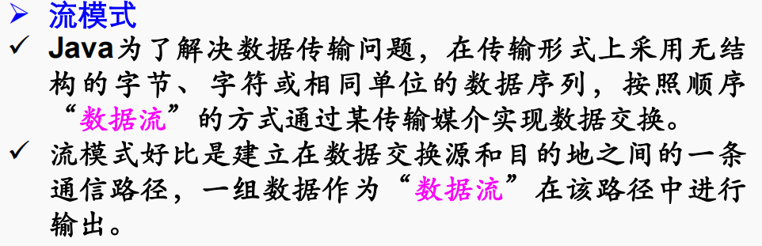
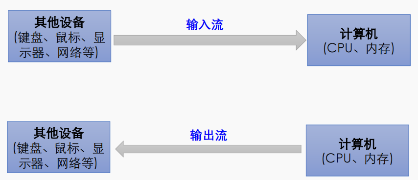
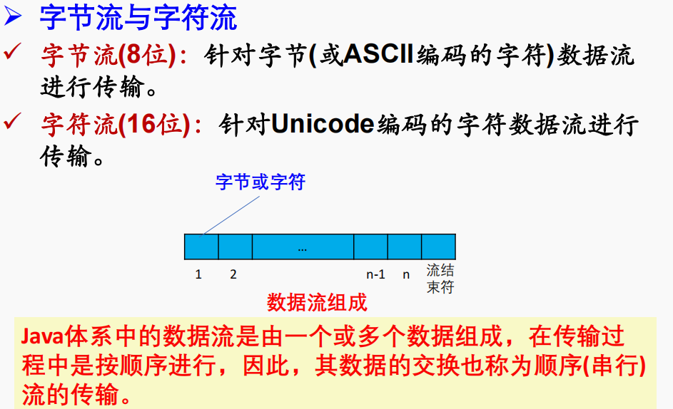
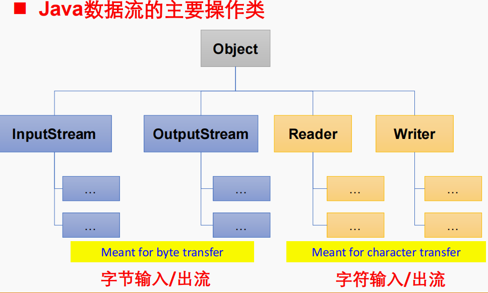
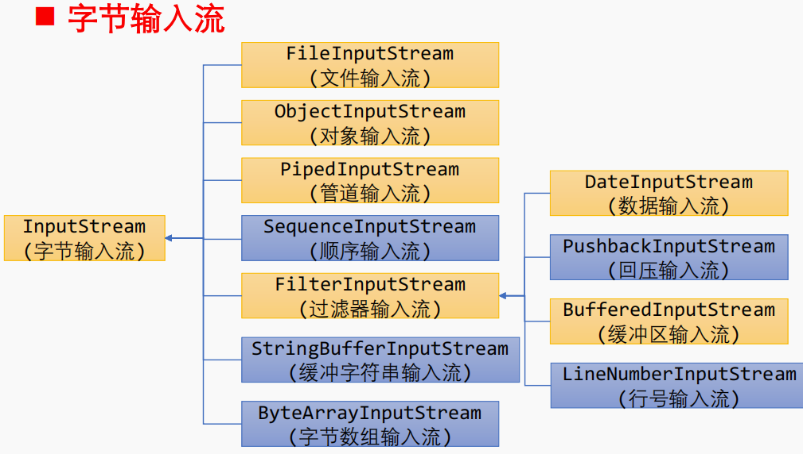
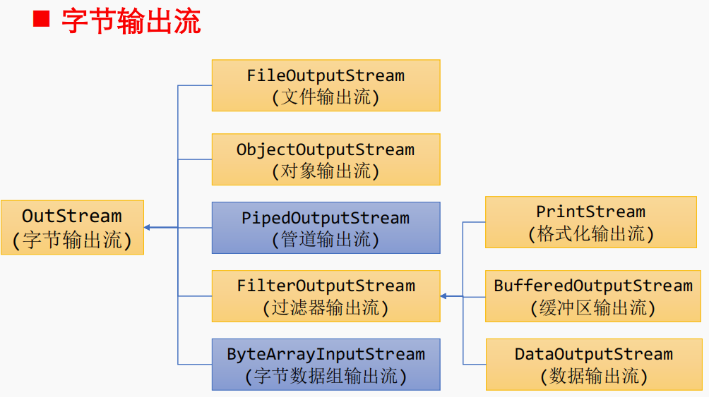
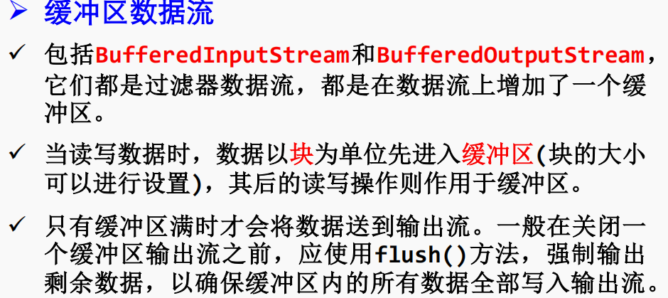
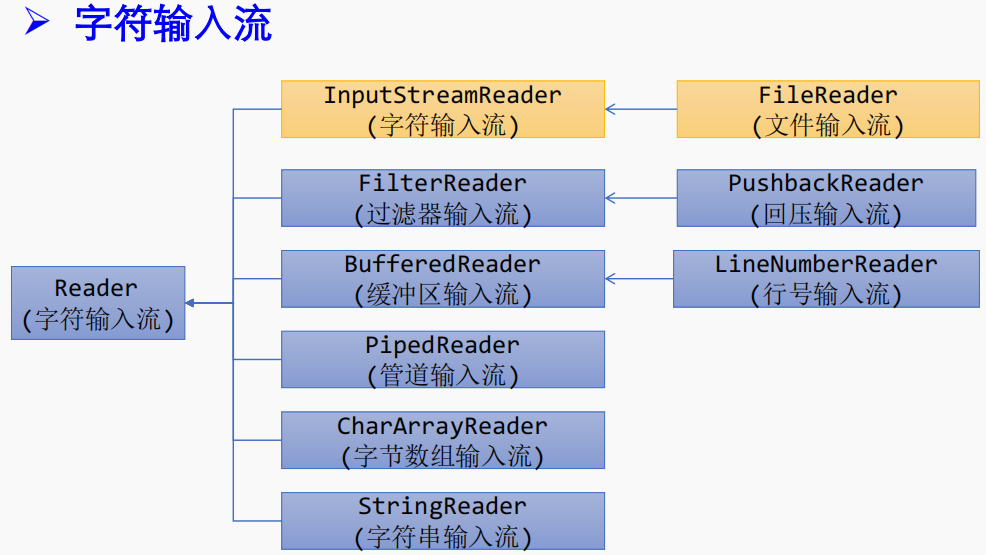

在计算机科学中，字节（Byte）和字符（Character）是两个不同的概念，其主要区别在于数据的表示和处理方式。

1. **字节（Byte）：**
    - 字节是计算机存储的基本单位，通常由8个比特（bits）组成。
    - 字节是二进制数据的基本单元，在计算机中用于存储和表示各种数据，包括整数、小数、文本、图像等。
    - 字节的范围是0到255，可以表示256个不同的值。
    - 字节流是以字节为单位进行读写的流，适用于处理二进制数据。

2. **字符（Character）：**
    - 字符是人类可读的文本表示中的基本单位，通常表示一个字母、数字、标点符号或其他可打印的符号。
    - 字符通常使用字符集（Character Set）进行编码，例如 ASCII、UTF-8、UTF-16 等。
    - 字符的表示方式是与字符集相关的，不同的字符集可以使用不同的编码方案。
    - 字符流是以字符为单位进行读写的流，适用于处理文本数据。

**主要区别：**

- 字节是二进制数据的基本单元，可以用于存储任何类型的数据。
- 字符是人类可读的文本表示的基本单元，通常需要使用字符集进行编码和解码。
- 字节流适用于处理二进制数据，而字符流适用于处理文本数据。

在实际编程中，需要根据处理的数据类型选择合适的流。例如，处理文本数据时通常使用字符流，而处理图像、音频等二进制数据时则使用字节流。在
Java 中，`InputStream` 和 `OutputStream` 是字节流的抽象基类，而 `Reader` 和 `Writer` 是字符流的抽象基类。

**input是拿到程序中，output是拿出程序**




`BufferedInputStream` 和 `BufferedOutputStream` 的默认缓冲区大小通常是 8 KB。这意味着在读写数据时，它们会以 8 KB
的块为单位进行操作。这个大小是经验性选择的，可以在绝大多数情况下提供良好的性能。

在 Java 中，可以通过构造函数指定缓冲区大小。例如：

```java
BufferedInputStream bin=new BufferedInputStream(new FileInputStream("file.txt"),bufferSize);
BufferedOutputStream bout=new BufferedOutputStream(new FileOutputStream("file.txt"),bufferSize);
```

在这里，`bufferSize` 是希望使用的缓冲区大小，以字节为单位。如果不指定缓冲区大小，那么将使用默认的大小（通常是 8
KB）。选择缓冲区大小的最佳值可能取决于具体的应用场景和硬件环境。


文件操作函数
```java
public static void directoryInformation(File d) {
    System.out.println(d.getAbsolutePath());
    String[] str = d.list();
    int iDirCount = 0, iFileCount = 0;
    long lSize = 0;

    for (int i = 0; i < str.length; i++) {
        File flTemp = new File(d.getAbsolutePath(), str[i]);
        if (flTemp.isFile()) {
            System.out.println(str[i] + "\t" + flTemp.length() + "\t" + new Date(flTemp.lastModified()));
            iFileCount++;
            lSize = lSize + flTemp.length();
        }

        if (flTemp.isDirectory()) {
            System.out.println(str[i] + "\t<DIR>");
            iDirCount++;
        }
    }

    System.out.println(iFileCount + " files\t" + lSize + " bytes");
    System.out.println(iDirCount + " dir(s)");
}

```
