在Java中，线程是一种轻量级的子进程，它可以独立运行并发地执行任务。Java语言内置了对多线程编程的支持，通过使用线程，可以实现并发执行、异步处理和提高程序的性能。以下是关于Java线程的基本概念和使用方法：

1. 创建线程：
    - 继承Thread类：创建一个继承自Thread类的子类，并重写其run()方法来定义线程的执行逻辑。
    - 实现Runnable接口：定义一个实现了Runnable接口的类，并实现其run()方法，然后将该实例传递给Thread类的构造函数创建线程。

2. 启动线程：
    - 调用线程对象的start()方法来启动线程，而不是直接调用run()方法。start()方法会在新线程中执行run()方法中的逻辑。

3. 线程生命周期：
    - 新建（New）：创建线程对象。
    - 就绪（Runnable）：线程可以开始运行，等待获取CPU时间片。
    - 运行（Running）：获取到CPU时间片，正在执行任务。
    - 阻塞（Blocked）：线程被挂起，等待某个条件满足（如I/O操作完成、获取锁等）。
    - 终止（Terminated）：线程执行完毕或者出现异常终止。

4. 线程控制：
    - 线程睡眠：使用Thread.sleep()方法让线程暂停执行一段时间。
    - 线程等待：使用Object.wait()方法使线程等待，直到其他线程调用notify()或notifyAll()方法唤醒它。
    - 线程加入：使用join()方法等待另一个线程执行完毕。
    - 线程中断：使用interrupt()方法给线程发送中断信号。

5. 线程同步：
    - 使用关键字synchronized或者Lock接口来实现线程同步，防止多个线程同时访问共享资源导致的数据不一致或者异常。

6. 线程通信：
    - 可以使用wait()、notify()和notifyAll()方法来实现线程之间的通信。

# 并发与并行

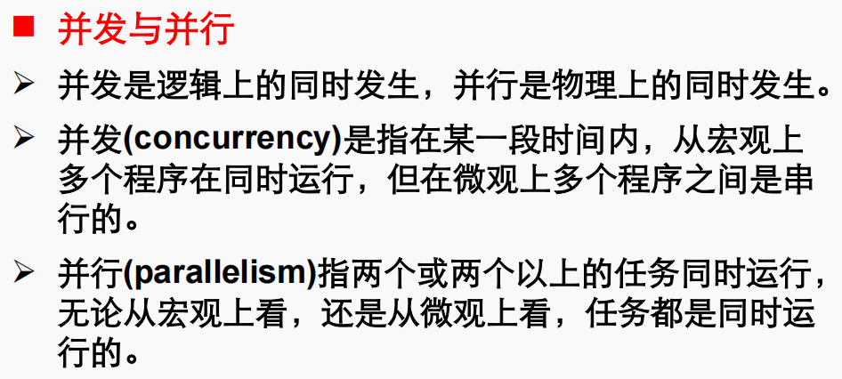
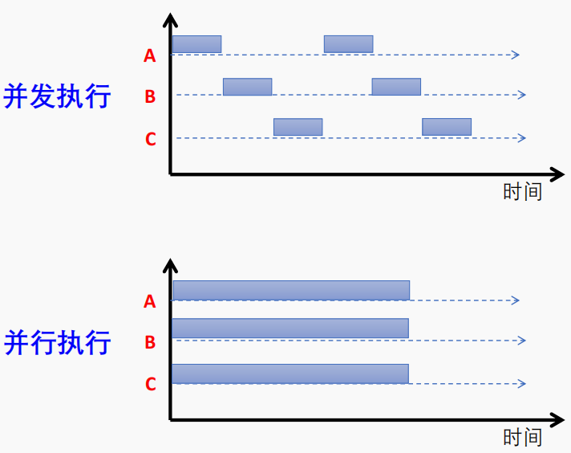

# 线程的状态

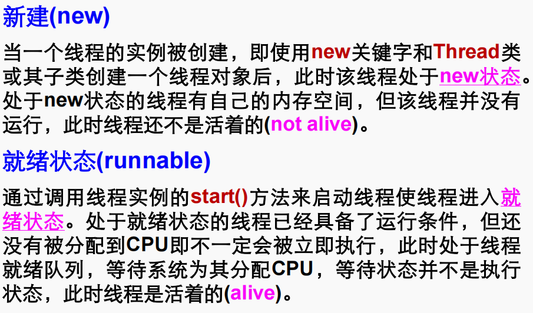
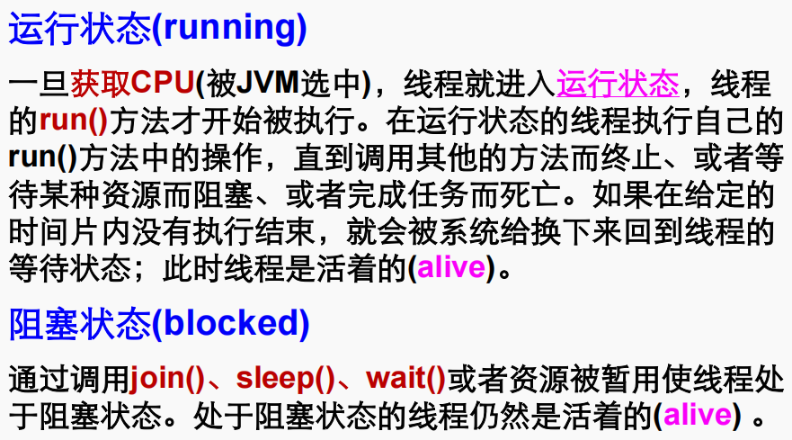
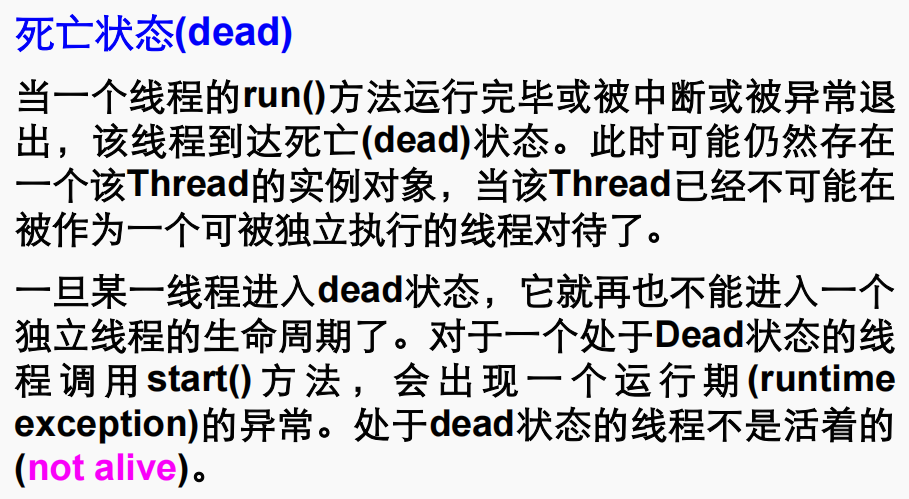

# Thread使用

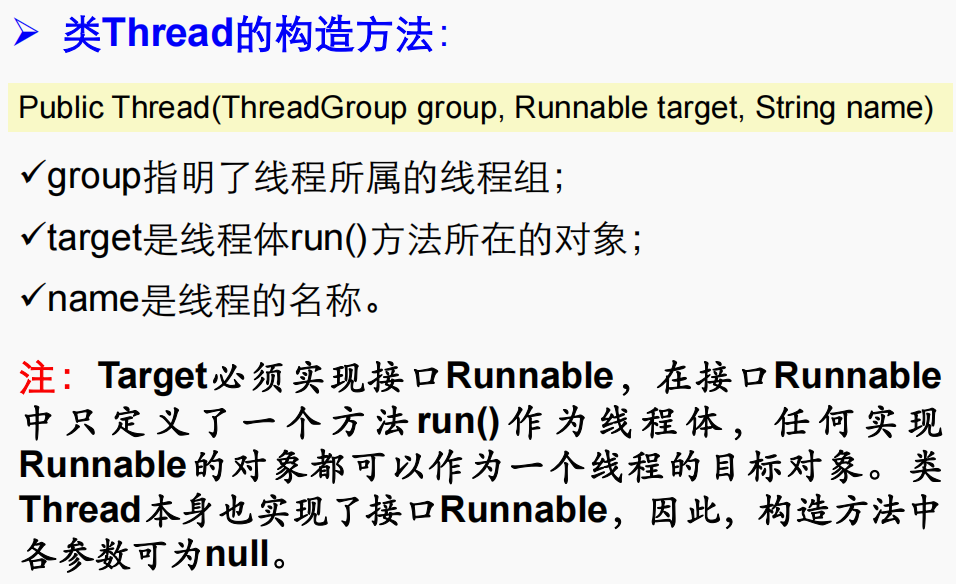

# 创建线程的方法

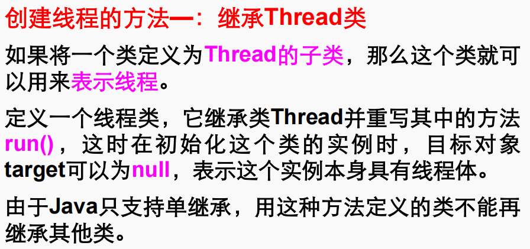

当使用继承Thread类的方式来创建线程时，可以按照以下步骤进行：

1. 定义一个继承自Thread类的子类，并重写其run()方法来定义线程的执行逻辑。
2. 在子类中，可以添加其他成员变量和方法，用于辅助线程的执行。
3. 在主程序中，创建子类的实例对象，并调用start()方法启动线程。

下面是一个简单的例子：

```java
// 继承Thread类的线程子类
class MyThread extends Thread {
    public void run() {
        // 定义线程的执行逻辑
        for (int i = 0; i < 5; i++) {
            System.out.println("线程执行：" + i);
            try {
                Thread.sleep(1000);  // 线程睡眠1秒
            } catch (InterruptedException e) {
                e.printStackTrace();
            }
        }
    }
}

public class Main {
    public static void main(String[] args) {
        // 创建线程对象
        MyThread thread = new MyThread();
        // 启动线程
        thread.start();

        // 主线程的执行逻辑
        for (int i = 0; i < 5; i++) {
            System.out.println("主线程执行：" + i);
            try {
                Thread.sleep(1000);  // 主线程睡眠1秒
            } catch (InterruptedException e) {
                e.printStackTrace();
            }
        }
    }
}
```

在上述例子中，我们定义了一个继承自Thread类的子类MyThread，并在其中重写了run()
方法，定义了线程的执行逻辑。在主程序中，创建MyThread类的实例对象并调用start()
方法，启动线程。同时，主线程继续执行自己的逻辑。运行程序后，可以看到子线程和主线程交替执行，每个线程睡眠1秒钟。

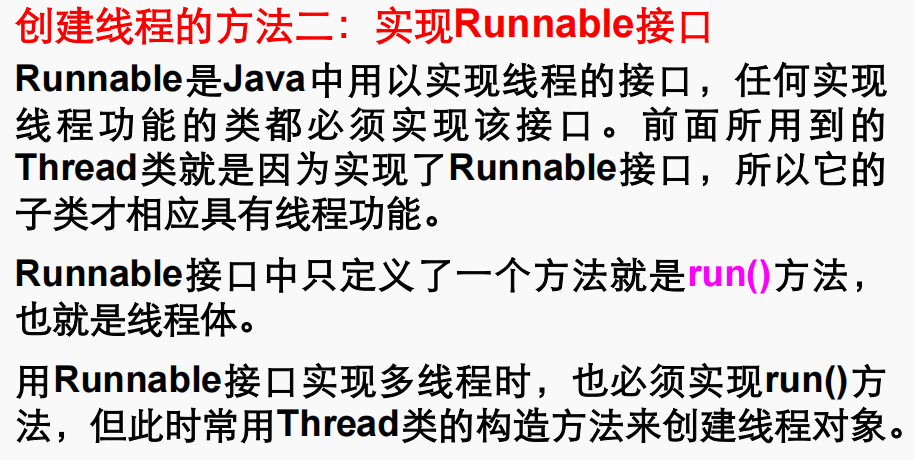

当使用实现Runnable接口的方式来创建线程时，可以按照以下步骤进行：

1. 定义一个实现了Runnable接口的类，并实现其run()方法来定义线程的执行逻辑。
2. 在主程序中，创建该实现类的实例对象。
3. 创建Thread类的实例对象，将实现类的实例对象作为参数传递给Thread类的构造函数。
4. 调用Thread对象的start()方法启动线程。

下面是一个简单的例子：

```java
// 实现Runnable接口的线程类
class MyRunnable implements Runnable {
    public void run() {
        // 定义线程的执行逻辑
        for (int i = 0; i < 5; i++) {
            System.out.println("线程执行：" + i);
            try {
                Thread.sleep(1000);  // 线程睡眠1秒
            } catch (InterruptedException e) {
                e.printStackTrace();
            }
        }
    }
}

public class Main {
    public static void main(String[] args) {
        // 创建实现Runnable接口的对象
        MyRunnable myRunnable = new MyRunnable();
        // 创建线程对象，将实现类对象作为参数传递
        Thread thread = new Thread(myRunnable);
        // 启动线程
        thread.start();

        // 主线程的执行逻辑
        for (int i = 0; i < 5; i++) {
            System.out.println("主线程执行：" + i);
            try {
                Thread.sleep(1000);  // 主线程睡眠1秒
            } catch (InterruptedException e) {
                e.printStackTrace();
            }
        }
    }
}
```

在上述例子中，我们定义了一个实现了Runnable接口的类MyRunnable，并在其中实现了run()
方法，定义了线程的执行逻辑。在主程序中，创建MyRunnable类的实例对象，并将其作为参数传递给Thread类的构造函数创建线程对象。然后，调用线程对象的start()
方法启动线程。同时，主线程继续执行自己的逻辑。运行程序后，可以看到子线程和主线程交替执行，每个线程睡眠1秒钟。

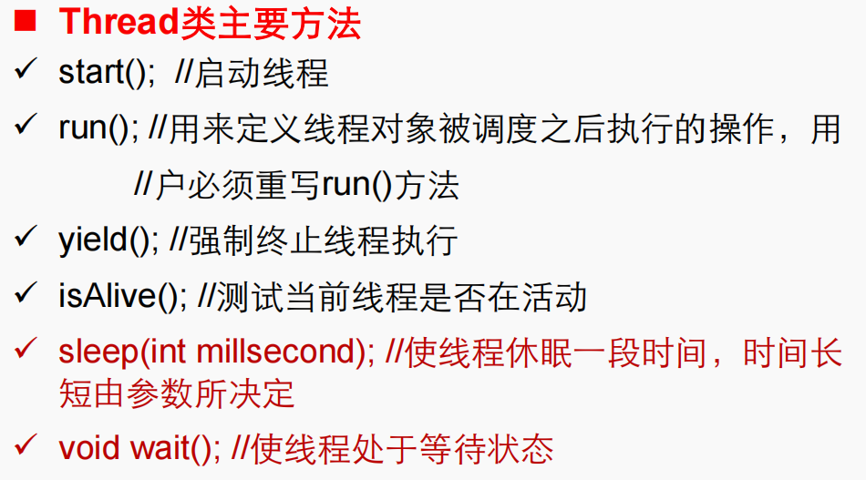
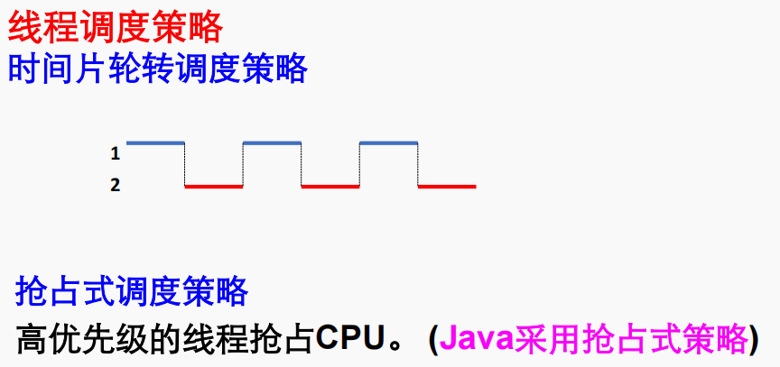
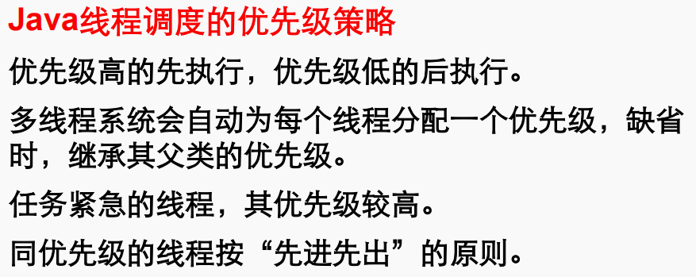
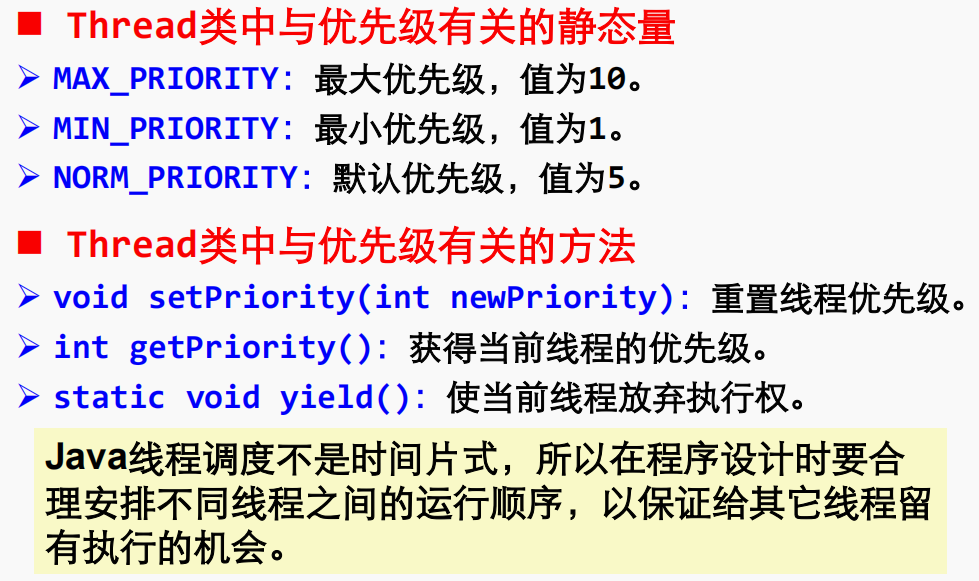

在Java中，线程的优先级可以通过Thread类的setPriority()
方法进行设置，优先级范围从1到10，其中1为最低优先级，10为最高优先级。当线程处于就绪状态时，多线程系统会根据线程的优先级来决定哪个线程首先获得CPU执行时间。

下面是一个简单的例子，演示了线程的优先级设置和调度：

```java
class MyThread implements Runnable {
    public void run() {
        for (int i = 0; i < 3; i++) {
            System.out.println(Thread.currentThread().getName() + " is running");
        }
    }
}

public class Main {
    public static void main(String[] args) {
        MyThread myThread = new MyThread();

        Thread thread1 = new Thread(myThread, "Thread-1");
        Thread thread2 = new Thread(myThread, "Thread-2");

        // 设置线程优先级
        thread1.setPriority(Thread.MIN_PRIORITY); // 最低优先级
        thread2.setPriority(Thread.MAX_PRIORITY); // 最高优先级

        thread1.start();
        thread2.start();
    }
}
```

在上述例子中，我们创建了一个实现了Runnable接口的类MyThread，并在主程序中创建了两个线程对象thread1和thread2，然后分别设置它们的优先级为最低和最高。当运行这段代码时，由于Thread-2的优先级高于Thread-1，所以Thread-2会有更大的机会先执行，但并不代表一定会先执行完毕，这仅仅是一个
**概率上的倾向**。

# 我自己验证了一下，线程2完全跑赢1的概率确实大，但是具体数值却是不确定的


```java
package ThreadTest;

class Producer implements Runnable {
    private final int[] arr;

    public Producer(int[] arr) {
        this.arr = arr;
    }

    public void run() {
        System.out.println("Initializing...");
        for (int i = 0; i < arr.length; i++) {
            arr[i] = (int) (Math.random() * 10);
            System.out.print(arr[i] + ",");
            if ((i + 1) % 10 == 0) System.out.println();
        }
        System.out.println();
    }
}

class Worker implements Runnable {
    private final int[] arr;
    private final Thread thread;

    public Worker(int[] arr, Thread thread) {
        this.arr = arr;
        this.thread = thread;
    }

    public void run() {
        try {
            thread.join();
        } catch (InterruptedException e) {
            e.printStackTrace();
        }
        System.out.println("Calculating...");
        int sum = 0;
        for (int j : arr) {
            sum += j;
        }
        ThreadTest4.sum = sum;
    }
}

class PrintTask implements Runnable {
    private final Thread thread;

    public PrintTask(Thread thread) {
        this.thread = thread;
    }

    public void run() {
        try {
            thread.join();
        } catch (InterruptedException e) {
            e.printStackTrace();
        }
        System.out.println("sum=" + ThreadTest4.sum);
    }
}

public class ThreadTest4 {
    static int sum = 0;

    public static void main(String[] args) throws InterruptedException {
        int[] arr = new int[10];

        Thread producer = new Thread(new Producer(arr));
        producer.start();

        Thread worker = new Thread(new Worker(arr, producer));
        worker.start();

        Thread printTask = new Thread(new PrintTask(worker));
        printTask.start();

        printTask.join();

        int sum1 = 0;
        for (int j : arr) {
            sum1 += j;
        }

        if (sum == sum1) {
            System.out.println("Verification passed!");
        } else {
            System.out.println("Verification failed! sum=" + sum + ", sum1=" + sum1);
        }
    }
}

```

```
Initializing...
7,8,8,2,5,7,3,3,0,4,

Calculating...
sum=47
Verification passed!
```

#### 只有在调用的join的线程结束之后，才会继续往下进行

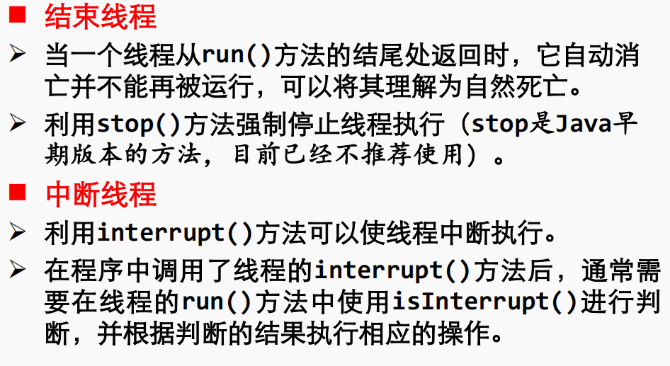

在下面的示例中，我们将展示如何使用interrupt()方法中断线程的执行。

```java
class MyThread extends Thread {
    public void run() {
        try {
            while (!isInterrupted()) {
                System.out.println("Running...");
                Thread.sleep(1000);
            }
        } catch (InterruptedException e) {
            System.out.println("Thread interrupted");
        }
        System.out.println("Thread finished");
    }
}

public class Main {
    public static void main(String[] args) {
        MyThread thread = new MyThread();
        thread.start();
        
        try {
            Thread.sleep(5000); // 让主线程休眠5秒钟
        } catch (InterruptedException e) {
            e.printStackTrace();
        }
        
        thread.interrupt(); // 中断线程的执行
        
        System.out.println("Main thread finished");
    }
}
```

在上面的示例中，我们创建了一个继承自Thread的MyThread类，其中的run()方法中使用了isInterrupted()方法来判断线程是否被中断。在主线程中，我们创建了一个MyThread对象并启动它，然后让主线程休眠5秒钟后调用thread.interrupt()方法中断线程的执行。

当通过interrupt()方法中断线程时，线程会抛出InterruptedException，并进入catch块中的处理逻辑，打印出"Thread interrupted"。接着，线程会继续执行剩余的代码，并打印出"Thread finished"表示线程的执行结束。

当主线程执行完毕后，会打印出"Main thread finished"。通过在MyThread的run()方法中使用isInterrupted()方法判断线程是否被中断，我们可以灵活地根据需要执行相应的操作。


# 线程之间的通信：pip
```java
package ThreadTest;

import java.io.*;

class MyWriter extends Thread {
  PipedOutputStream pos; // 管道输出数据流
  private final String[] messages = {
    "Monday", "Tuesday", "Wednesday", "Thursday", "Friday", "Saturday", "Sunday"
  }; // 写入数据

  public MyWriter(PipedOutputStream pos) {
    this.pos = pos;
  }

  public void run() {
    try {
      // 数据输出数据流
      DataOutputStream dos = new DataOutputStream(pos);
      // 数据长度
      int size = 7;
      dos.writeInt(size); // 写入数据长度

      // 写入数据
      for (String message : messages) {
        dos.writeUTF(message);
        System.out.println("Write: " + message);
        try {
          sleep(300);
        } catch (InterruptedException e) {
          e.printStackTrace();
        }
      }

      dos.close();
    } catch (IOException e) {
      e.printStackTrace();
    }
  }
}

class MyReader extends Thread {
  PipedInputStream pis; // 管道输入数据流

  public MyReader(PipedInputStream pis) {
    this.pis = pis;
  }

  public void run() {
    try {
      // 数据输入数据流
      DataInputStream dis = new DataInputStream(pis);
      int size = dis.readInt(); // 读取数据长度
      // 接收数据
      String[] messages = new String[size]; // 设置数据长度

      // 读取数据
      for (int i = 0; i < messages.length; i++) {
        messages[i] = dis.readUTF();
        System.out.println("Read: " + messages[i]);
        try {
          sleep(400);
        } catch (InterruptedException e) {
          e.printStackTrace();
        }
      }

      dis.close();
    } catch (IOException e) {
      e.printStackTrace();
    }
  }
}

public class ThreadTest6 {
  public static void main(String[] args) {
    ThreadTest6 thisPipe = new ThreadTest6();
    thisPipe.process();
  }

  public void process() {
    PipedInputStream inStream; // 管道输入流
    PipedOutputStream outStream; // 管道输出流

    try {
      // 建立输入流与输出流之间的连接
      outStream = new PipedOutputStream();
      inStream = new PipedInputStream(outStream);

      new MyWriter(outStream).start(); // 启动写线程
      new MyReader(inStream).start(); // 启动读线程
    } catch (IOException e) {
      e.printStackTrace();
    }
  }
}

```

# 锁

### 方法锁
```java
package ThreadTest;

import java.util.ArrayList;
import java.util.List;

public class ThreadTest7 implements Runnable {
  static List<String> list = new ArrayList<String>();

  // 实例方法同步
  public static synchronized void add() throws InterruptedException {
    String name = Thread.currentThread().getName();
    for (int i = 0; i < 5; i++) {
      list.add(name);
      Thread.sleep(200);
    }
  }

  // 线程体
  public void run() {
    try {
      add();
    } catch (InterruptedException e) {
      e.printStackTrace();
    }
  }

  public static void main(String[] args) throws InterruptedException {
    ThreadTest7 t1 = new ThreadTest7(); // 创建实例t1
    ThreadTest7 t2 = new ThreadTest7(); // 创建实例t2
    Thread ta = new Thread(t1, "A"); // 创建线程对象
    Thread th = new Thread(t2, "B"); // 创建线程对象
    Thread tc = new Thread(t2, "C"); // 创建线程对象

    // 启动线程
    ta.start();
    th.start();
    tc.start();

    // 在主线程之前执行
    ta.join();
    th.join();
    tc.join();

    System.out.println("ThreadSynch.list: " + list);
  }
}

```
### 对代码块进行锁

```java
public void add() throws InterruptedException {
    String name = Thread.currentThread().getName();
    synchronized (this) { // 语句块同步，将当前对象作为锁
        for (int i = 0; i < 5; i++) {
            list.add(name);
            Thread.sleep(200);
        }
    }

    String name2 = Thread.currentThread().getName();
    synchronized (ThreadSync.class) { // 语句块同步，指定的锁为整个类
        for (int i = 0; i < 5; i++) {
            list.add(name2);
            Thread.sleep(200);
        }
    }
}

```


# 单缓冲区的线程唤醒
```java
package ThreadTest;

class CubbyHole {
  private int goods; // 缓冲区数据
  private boolean empty; // 缓冲区是否为空

  public CubbyHole() {
    empty = true; // 初始缓冲区为空
  }

  public synchronized int get() {
    // 当缓冲区为空
    while (empty) {
      try {
        wait(); // 让调用get方法的线程进入等待集合中
      } catch (InterruptedException e) {
        e.printStackTrace();
      }
    }
    System.out.println("消费者拿走了物品" + goods);
    empty = true; // 设置缓冲区为空
    notify(); // 唤醒等待集合中的线程
    return goods;
  }

  public synchronized void put(int value) {
    // 如果缓冲区不为空
    while (!empty) {
      try {
        wait(); // 让调用put方法的线程进入等待集合中
      } catch (InterruptedException e) {
        e.printStackTrace();
      }
    }
    goods = value; // 向缓冲区放入数据value
    System.out.println("生产者生产了物品" + goods);
    empty = false; // 设置缓冲区为非空
    notify(); // 唤醒等待集合中的线程
  }
}

// 生产者
class Producer1 extends Thread {
  private final CubbyHole cubbyHole;

  public Producer1(CubbyHole c) {
    cubbyHole = c;
  }

  public void run() {
    // 向缓冲区放入1-100之间的50个随机数
    for (int i = 0; i < 50; i++) {
      cubbyHole.put(i);
    }
  }
}

// 消费者
class Consumer extends Thread {
  private final CubbyHole cubbyHole;

  public Consumer(CubbyHole c) {
    cubbyHole = c;
  }

  public void run() {
    for (int i = 0; i < 50; i++) {
      cubbyHole.get();
    }
  }
}

// Main类
public class ThreadTest8 {
  public static void main(String[] args) {
    // 创建单缓冲区
    CubbyHole c = new CubbyHole();

    // 创建生产者
    Producer1 producer = new Producer1(c);
    producer.start();

    // 创建消费者
    Consumer consumer = new Consumer(c);
    consumer.start();
  }
}

```


