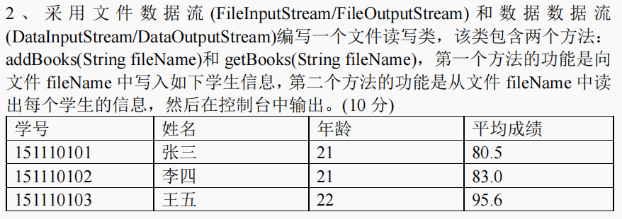

# 1
定义一个几何图形抽象类 Geometry，该抽象类中包含一个计算面积的抽象
方法 getArea()。类 Geometry 有两个子类：圆 Circle 和矩形 Rectangle，它们都
需要重写 Geometry 类的 getArea()方法来计算各自的面积。类 Circle 包含一个半
径属性 radius，类 Rectangle 包含两个属性：高度 height 和宽度 width。定义一
个柱体类 Pillar，该类中包含两个属性：底面 bottom 和高 height，bottom 的类
型是 Geometry，height 的类型是 double。类 Pillar 中有一个计算体积的方法
getVolume()，其调用类 Geometry 的方法 getArea()来计算底面积。
### (1)完成类 Geometry、Circle、Rectangle 和 Pillar 的代码编写。(8 分)
```java
abstract class Geometry {
  public abstract double getArea();
}

class Pillar {
  private Geometry bottom;
  private double height;

  public double getVolume() {
    return bottom.getArea() * height;
  }

  Pillar(Geometry bottom, double height) {
    this.bottom = bottom;
    this.height = height;
  }
}

class Rectangle extends Geometry {

  private double height;
  private double width;

  @Override
  public double getArea() {
    return height * width;
  }

  Rectangle(double height, double width) {
    this.height = height;
    this.width = width;
  }
}

class Circle extends Geometry {

  private double radius;

  @Override
  public double getArea() {
    return radius * radius;
  }

  Circle(double radius) {
    this.radius = radius;
  }
}

```
### (2)采用 UML 建模方法画出相应的类图，要求写出每个类的名称、属性、方法以及类之间的关系。(7 分)


### (3)编写一个测试类 Test，该类可以用 Pillar 和 Geometry 来计算底面为圆形和矩形的体积。(5 分)
```java
public class Test {
  public static void main(String[] args) {
    Geometry geometry = new Circle(3);
    Geometry geometry1 = new Rectangle(2, 3);

    Pillar pillar = new Pillar(geometry, 2);
    System.out.println(pillar.getVolume());

    Pillar pillar1 = new Pillar(geometry1, 3);
    System.out.println(pillar1.getVolume());
  }
}
```
# 2

```java
class FileReadWrite {
  public void addBooks(String fileName) {
    try {
      FileOutputStream fos = new FileOutputStream(fileName);
      DataOutputStream dos = new DataOutputStream(fos);

      dos.writeUTF("学号\t姓名\t年龄\t平均成绩");
      dos.writeUTF("151110101\t张三\t21\t80.5");
      dos.writeUTF("151110102\t李四\t21\t83.0");
      dos.writeUTF("151110103\t王五\t22\t95.6");

      dos.close();
      fos.close();
      System.out.println("学生信息已写入文件：" + fileName);
    } catch (IOException e) {
      e.printStackTrace();
    }
  }

  public void getBooks(String fileName) {
    try {
      FileInputStream fis = new FileInputStream(fileName);
      DataInputStream dis = new DataInputStream(fis);

      String line;
      while ((line = dis.readUTF()) != null) {
        System.out.println(line);
      }

      dis.close();
      fis.close();
    } catch (EOFException e) {
      // 文件读取结束
    } catch (IOException e) {
      e.printStackTrace();
    }
  }
}

```
# 3
利用 Java Socket 编写一个简单的通信程序，该程序包含两个类：Client 和
Server，其中，Client 为客户端，Server 为服务器端。客户端通过 Socket 与 IP
地址为 202.102.144.106、端口号为 5432 的服务器端程序建立连接，向其传递一
组整数，服务器端通过 ServerSocket 接收客户端发送的一组整数后，计算这组
整数的和，然后将其返回给客户端。(10 分)


