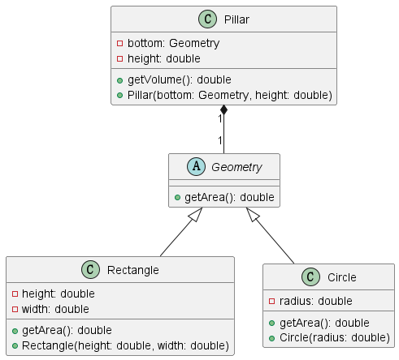

# 1
定义一个几何图形抽象类 Geometry，该抽象类中包含一个计算面积的抽象
方法 getArea()。类 Geometry 有两个子类：圆 Circle 和矩形 Rectangle，它们都
需要重写 Geometry 类的 getArea()方法来计算各自的面积。类 Circle 包含一个半
径属性 radius，类 Rectangle 包含两个属性：高度 height 和宽度 width。定义一
个柱体类 Pillar，该类中包含两个属性：底面 bottom 和高 height，bottom 的类
型是 Geometry，height 的类型是 double。类 Pillar 中有一个计算体积的方法
getVolume()，其调用类 Geometry 的方法 getArea()来计算底面积。
### (1)完成类 Geometry、Circle、Rectangle 和 Pillar 的代码编写。(8 分)
```java
abstract class Geometry {
  public abstract double getArea();
}

class Pillar {
  private Geometry bottom;
  private double height;

  public double getVolume() {
    return bottom.getArea() * height;
  }

  Pillar(Geometry bottom, double height) {
    this.bottom = bottom;
    this.height = height;
  }
}

class Rectangle extends Geometry {

  private double height;
  private double width;

  @Override
  public double getArea() {
    return height * width;
  }

  Rectangle(double height, double width) {
    this.height = height;
    this.width = width;
  }
}

class Circle extends Geometry {

  private double radius;

  @Override
  public double getArea() {
    return Math.PI * radius * radius;
  }

  Circle(double radius) {
    this.radius = radius;
  }
}

```
### (2)采用 UML 建模方法画出相应的类图，要求写出每个类的名称、属性、方法以及类之间的关系。(7 分)


### (3)编写一个测试类 Test，该类可以用 Pillar 和 Geometry 来计算底面为圆形和矩形的体积。(5 分)
```java
public class Test {
  public static void main(String[] args) {
    Geometry geometry = new Circle(3);
    Geometry geometry1 = new Rectangle(2, 3);

    Pillar pillar = new Pillar(geometry, 2);
    System.out.println(pillar.getVolume());

    Pillar pillar1 = new Pillar(geometry1, 3);
    System.out.println(pillar1.getVolume());
  }
}
```
# 2

```java
class FileReadWrite {
  public void addBooks(String fileName) {
    try {
      FileOutputStream fos = new FileOutputStream(fileName);
      DataOutputStream dos = new DataOutputStream(fos);

      dos.writeUTF("学号\t姓名\t年龄\t平均成绩");
      dos.writeUTF("151110101\t张三\t21\t80.5");
      dos.writeUTF("151110102\t李四\t21\t83.0");
      dos.writeUTF("151110103\t王五\t22\t95.6");

      dos.close();
      fos.close();
      System.out.println("学生信息已写入文件：" + fileName);
    } catch (IOException e) {
      e.printStackTrace();
    }
  }

  public void getBooks(String fileName) {
    try {
      FileInputStream fis = new FileInputStream(fileName);
      DataInputStream dis = new DataInputStream(fis);

      String line;
      while ((line = dis.readUTF()) != null) {
        System.out.println(line);
      }

      dis.close();
      fis.close();
    } catch (EOFException e) {
      // 文件读取结束
    } catch (IOException e) {
      e.printStackTrace();
    }
  }
}

```
# 3
利用 Java Socket 编写一个简单的通信程序，该程序包含两个类：Client 和
Server，其中，Client 为客户端，Server 为服务器端。客户端通过 Socket 与 IP
地址为 202.102.144.106、端口号为 5432 的服务器端程序建立连接，向其传递一
组整数，服务器端通过 ServerSocket 接收客户端发送的一组整数后，计算这组
整数的和，然后将其返回给客户端。(10 分)

```java

import java.io.*;
import java.net.ServerSocket;
import java.net.Socket;

public class Server {
  public static void main(String[] args) throws IOException {

    ServerSocket serverSocket = new ServerSocket(5432);
    System.out.println("waiting ...");
    Socket socket = serverSocket.accept();
    System.out.println("connected!");

    InputStream inputStream = socket.getInputStream();
    DataInputStream dataInputStream = new DataInputStream(inputStream);

    int sum = 0;
    while (dataInputStream.available() > 0) {
      int number = dataInputStream.readInt();
//      System.out.println(number);
      sum += number;
    }

    System.out.println("calculated!");

    OutputStream outputStream = socket.getOutputStream();
    DataOutputStream dataOutputStream = new DataOutputStream(outputStream);
    dataOutputStream.writeInt(sum);
    System.out.println("the data has been sent");

    outputStream.close();
    dataOutputStream.close();

    dataInputStream.close();
    inputStream.close();
  }
}

```
```java
import java.io.*;
import java.net.Socket;

public class Client {
  public static void main(String[] args) throws IOException {
    Socket socket = new Socket("localhost", 5432);

    OutputStream outputStream = socket.getOutputStream();
    DataOutputStream dataOutputStream = new DataOutputStream(outputStream);
    int[] arrayInt = {1, 2, 3, 4, 5};
    for (int i : arrayInt) {
      dataOutputStream.writeInt(i);
    }

    dataOutputStream.flush();

    InputStream inputStream = socket.getInputStream();
    DataInputStream dataInputStream = new DataInputStream(inputStream);

    System.out.println(dataInputStream.readInt());

    dataOutputStream.close();
    outputStream.close();
    inputStream.close();
    dataOutputStream.close();
  }
}

```


#### 注释：
`accept()`方法是`ServerSocket`类中的一个方法，它用于监听客户端的连接请求，并在有新的连接请求到达时接受该连接并返回一个`Socket`对象，用于与客户端进行通信。

具体来说，当调用`accept()`方法时，它会阻塞当前线程，直到有新的连接请求到达。一旦有新的连接请求到达，`accept()`方法将返回一个新的`Socket`对象，通过这个`Socket`对象，服务器端可以与客户端进行通信。

在您的代码中，`serverSocket.accept()`语句用于接受客户端的连接请求，并返回一个`Socket`对象来表示与客户端的通信。这个`Socket`对象将在之后被用于接收和发送数据。

总之，`accept()`方法是用于接受客户端连接请求的重要方法，它是服务器端建立通信的关键步骤之一。


在Java中，`available()`方法是用于获取输入流中可以被读取的字节数。具体来说，对于`InputStream`或者其子类，`available()`方法返回的是当前可读取的字节数，而不会阻塞线程等待更多的数据到达。

在您的代码中，`dataInputStream.available()`被用于检查输入流中是否还有可读取的数据，以便进行循环读取操作。然而，需要注意的是，`available()`方法的返回值并不总是准确的，它只是一个估计值，并不代表实际上可以读取的字节数。

因此，在使用`available()`方法时，应该谨慎处理，最好结合其他条件和逻辑来确保正确地读取输入流中的数据。特别是在网络通信中，`available()`方法的返回值可能并不准确，因为数据可能还在传输过程中，尚未完全到达。

如果您发现在使用`available()`方法时出现了问题，建议结合其他方法来确保正确地读取输入流中的数据，例如使用循环读取并判断结束标识等方式来处理数据流。


在Java中，`flush()`方法是用于强制将缓冲区中的数据立即写入到输出流中的方法。对于`OutputStream`或其子类，调用`flush()`方法可以确保缓冲区中的数据被及时写出，而不需要等到缓冲区满或流关闭时才进行写操作。

在网络编程中，特别是在使用Socket进行数据传输时，`flush()`方法非常重要。因为网络传输中存在缓冲区，如果不及时将数据从缓冲区写出，可能导致数据滞留在缓冲区中，无法及时发送给接收方。

因此，在您的代码中，如果您使用了`OutputStream`或者其子类来进行网络数据传输，建议在适当的时候调用`flush()`方法，以确保数据能够及时地发送给接收方。

总之，`flush()`方法在网络编程中是一个很常用的方法，它可以确保数据及时地发送出去，而不会滞留在缓冲区中。


