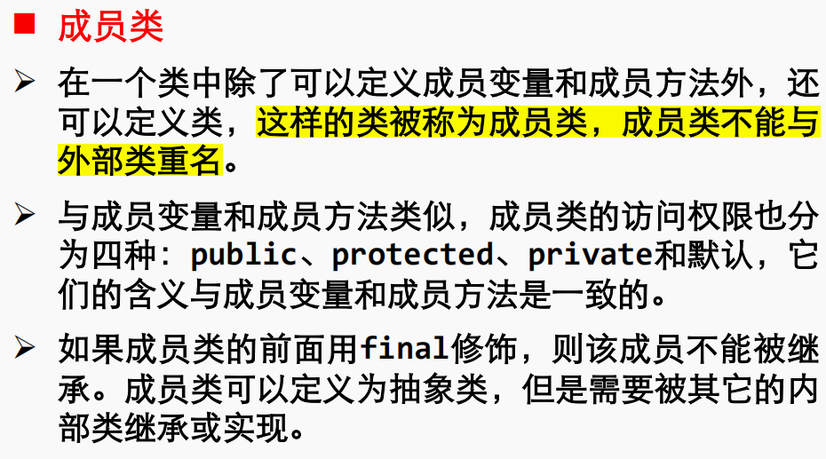

# 1

1.在 Java 中负责对字节代码解释执行的是 _____   B _____。
A. 垃圾回收器 B. 虚拟机 C.编译器 D. Servlet 容器

A. **垃圾回收器 (Garbage Collector):**

- 垃圾回收器是Java运行时环境的一部分，负责管理和释放不再被程序引用的内存。
- 它的主要任务是检测和回收不再使用的对象，以避免内存泄漏。

B. **虚拟机 (Virtual Machine):**

- Java虚拟机（JVM）是Java运行时环境的一部分，负责执行Java字节码。它提供了一个抽象的计算机环境，使得Java程序可以在各种不同的硬件和操作系统上运行。
- JVM解释并执行Java字节码，负责内存管理、垃圾回收、线程管理等。

C. **编译器 (Compiler):**

- 编译器负责将源代码翻译成目标代码，通常是机器码或者中间代码。在Java中，编译器将Java源代码编译成字节码。
- Java编译器将Java源代码转换成字节码文件（.class文件），而不是直接生成本地机器码。

D. **Servlet 容器 (Servlet Container):**

- Servlet容器是用于托管和执行Java Servlet的运行时环境。Servlet是用于构建Web应用程序的Java组件。
- Servlet容器负责解释执行Servlet代码，处理HTTP请求和响应，以及提供Servlet生命周期管理。

在给定的问题中，负责对字节代码解释执行的是Java虚拟机（B）。

# 2

2.下面哪个是嵌入在 HTML 中执行的 Java 程序____B_____。
A. Javabean B. Applet C. Servlet D. Socket

A. **JavaBean:**

- JavaBean 是一种符合特定编程规范的 Java 类，通常被设计用于在可视化开发环境中构建组件化的软件。它是一种可重用的软件组件，具有一些特定的命名约定和属性方法。
- JavaBean 不直接嵌入 HTML 中执行，而是通常在服务器端或其他 Java 应用程序中使用。

B. **Applet（小应用程序）:**

- Applet 是一种嵌入到 HTML 页面中的小型 Java 程序。在客户端浏览器中执行，具有图形用户界面。它使用 `<applet>` 标签将 Java
  小应用程序嵌入到 HTML 页面中，并通过 Java 插件在浏览器中执行。

C. **Servlet:**

- Servlet 是在服务器端执行的 Java 程序，通常用于处理客户端的请求和生成动态的 Web 内容。Servlet 被容器（例如
  Tomcat）管理，它接收来自客户端的请求并生成响应。
- Servlet 不嵌入在 HTML 中，而是在服务器端运行，处理来自客户端的请求。

D. **Socket:**

- Socket 是一种在网络上进行通信的机制，Java 中提供了 Socket 类用于实现网络通信。Socket 使得不同计算机上的程序能够通过网络进行数据交换。
- Socket 不是嵌入在 HTML 中执行的，而是用于处理底层网络通信。

在给定的问题中，嵌入在 HTML 中执行的 Java 程序是 Applet（小应用程序），因此正确的选项是 B。

# 3

3.下面哪个是 Java 的合法标识符_____A____。
A. _number B. interface C. #age D. public

在 Java 中，合法的标识符（Identifier）需要遵循一些规则。合法标识符必须以字母、下划线（_）或美元符号（$）开头，并且后续字符可以是字母、数字、下划线或美元符号。

# 4

4.下面哪个语句会引起编译错误_____C_____。
A. int a[]; B. short[] b; C. float[] c={1.0,2.0}; D. double d[]={1,2};

```java
float[]c={1.0f,2.0f};
```

# 5

5. 在 Java 的类继承关系中，需要遵循以下哪个继承原则_____B_____。
   A. 多重 B. 单一 C. 双重 D. 不能继承

# 6

6.如果类 A 的某个方法的返回类型是类 B，则 A 与 B 之间存在关系__D___。
A. 实例化 B. 关联 C. 继承 D. 依赖

当类 A 的某个方法的返回类型是类 B 时，这表示类 A 依赖于类 B。下面是一个简单的例子：

```java
// 类B
class B {
    public void methodB() {
        System.out.println("Method in class B");
    }
}

// 类A，它依赖于类B
class A {
    public B getInstanceOfB() {
        return new B();
    }
}

// 主程序
public class Example {
    public static void main(String[] args) {
        A instanceOfA = new A();

        // 类A的方法返回了类B的实例
        B instanceOfB = instanceOfA.getInstanceOfB();

        // 调用类B的方法
        instanceOfB.methodB();
    }
}
```

在这个例子中，类 `A` 的方法 `getInstanceOfB` 返回了类 `B` 的一个实例。这表示类 `A` 依赖于类 `B`，因为它使用（依赖于）类 `B`
的实例来执行特定的操作。这种依赖关系在实际的软件设计中很常见，它可以帮助实现代码的模块化和复用。

# 7

7. 如果子类不需要使用从父类继承来的方法功能，可以定义自己的方法，这是
   Java 中的____B______概念。
   A.重载 B.重写 C.继承 D.多态

A. **重载 (Overload):**

- 重载是指在同一个类中，可以定义多个方法，这些方法有相同的名称但具有不同的参数列表（类型或数量不同）。
- 重载的目的是为了提供一种方便的方式来使用相似的操作，具有相同的功能但可以处理不同类型的数据。

B. **重写 (Override):**

- 重写是指在子类中重新定义父类中已有的方法，以提供更具体或特定于子类的实现。
- 重写要求子类方法的签名（名称、返回类型、参数类型）与父类方法的签名相同。

C. **继承 (Inheritance):**

- 继承是指子类获取父类的属性和方法，使得子类能够重用父类的代码。子类可以继承父类的行为，并且可以添加新的行为或修改继承的行为。

D. **多态 (Polymorphism):**

- 多态是指对象可以根据其所属的实际类型以不同的方式呈现相同的接口。在Java中，多态通过方法重写（override）和接口实现实现。
- 多态性允许将不同类型的对象视为相同类型的对象，从而提高了代码的灵活性和可维护性。

在给定的问题中，如果子类不需要使用从父类继承来的方法功能并定义自己的方法，这是 **重写（Override）** 的概念。

多态是面向对象编程中的一个重要概念，它允许不同的对象对同一消息做出响应，使得程序可以在运行时表现出更多的灵活性。多态性主要通过方法重写和接口实现来实现。

### 1. 方法重写（Override）：

方法重写是实现多态的一种方式，它要求子类提供一个与父类相同签名（名称、返回类型、参数类型）的方法。当父类的引用指向子类的对象时，通过这个引用调用的方法实际上是子类中的方法。

```java
class Animal {
    void makeSound() {
        System.out.println("Animal makes a sound");
    }
}

class Dog extends Animal {
    // 重写父类方法
    void makeSound() {
        System.out.println("Dog barks");
    }
}

public class TestPolymorphism {
    public static void main(String[] args) {
        Animal animal = new Dog(); // 父类引用指向子类对象
        animal.makeSound(); // 调用的是子类的方法
    }
}
```

在这个例子中，`Animal` 类有一个 `makeSound` 方法，而 `Dog` 类重写了这个方法。当父类引用 `animal` 指向子类对象 `new Dog()`
时，调用 `makeSound` 方法时实际上执行的是 `Dog` 类中的方法，而不是 `Animal` 类中的方法。

### 2. 接口实现：

多态还可以通过接口实现。一个类可以实现多个接口，从而具有多种形式。在程序中，可以使用接口引用指向实现该接口的类的对象，从而实现多态。

```java
interface Shape {
    void draw();
}

class Circle implements Shape {
    void draw() {
        System.out.println("Drawing a circle");
    }
}

class Rectangle implements Shape {
    void draw() {
        System.out.println("Drawing a rectangle");
    }
}

public class TestPolymorphism {
    public static void main(String[] args) {
        Shape shape1 = new Circle(); // 接口引用指向实现类对象
        Shape shape2 = new Rectangle(); // 接口引用指向实现类对象

        shape1.draw(); // 调用的是 Circle 类的 draw 方法
        shape2.draw(); // 调用的是 Rectangle 类的 draw 方法
    }
}
```

在这个例子中，`Circle` 和 `Rectangle` 类都实现了 `Shape` 接口，可以通过 `Shape` 接口的引用来调用它们的 `draw` 方法，实现了多态。

# 8

8.在 Outer 类中定义一个静态成员类 Inner，需要在 main()方法中创建 Inner 类实
例对象，以下四种方式哪一种是正确的___________。
A. Inner in = new Inner();
B. Inner in = new Outer.Inner();
C. Outer.Inner in = new Outer.Inner();
D. Outer.Inner in = new Outer().new.Inner();



```java
public class EnclosingClass {
    int id;
    String name;
    static int counter = 0;

    public EnclosingClass(int id, String name) {
        this.id = id;
        this.name = name;
        counter++;
    }

    public void print() {
        // Create an instance of the non-static member class internally
        MemberClass mc = new MemberClass();
        mc.print();
    }

    // Non-static member class
    class MemberClass {
        String name;

        public void print() {
            System.out.println(
                    "id="
                            + id
                            + ", name="
                            + EnclosingClass.this
                            .name); // Access the non-static member variable of the enclosing class
            System.out.println(
                    "counter=" + counter); // Access the static member variable of the enclosing class
        }
    }

    public static void main(String[] args) {
        EnclosingClass ec1 = new EnclosingClass(1, "Tom");
        ec1.print();

        EnclosingClass ec2 = new EnclosingClass(2, "John");
        ec2.print();

        EnclosingClass ec3 = new EnclosingClass(3, "Dora");
        EnclosingClass.MemberClass mc =
                ec3.new MemberClass(); // Create an instance of the non-static member class externally
        mc.print();
    }
}

```

- 在这里外部类的print方法可以直接使用成员类进行创建
- 在成员类里进行调用外部对象的同名属性，需要使用：`Outer.this.attribute`
- 在一般情况下，创建外部类的一个成员类的对象写法是： `Outer.Inner inner = new Outer().new Inner()`
- 但是在外部类的里面创建成员类对象的时候写法很简单： `Inner inner = new Inner()`


```java
public class EnclosingClass1 {
  int id;
  String name;
  static int counter = 0;

  public EnclosingClass1(int id, String name) {
    this.id = id;
    this.name = name;
    counter++;
  }

  public void print() {
    MemberClass mc = new MemberClass(); // Create an instance of static member class internally
    System.out.println("id=" + id + ", name=" + name);
    mc.print();
  }

  // Static member class
  static class MemberClass {
    String name;

    public void print() {
      // System.out.println("id=" + id + ", name=" + EnclosingClass1.this.name);
      // Access the non-static member variable of the enclosing class
      // It seems like there's a commented line of code that's incomplete.

      System.out.println("counter=" + counter);
    }
  }

  public static void main(String[] args) {
    EnclosingClass1 ec1 = new EnclosingClass1(1, "Tom");
    ec1.print();

    EnclosingClass1 ec2 = new EnclosingClass1(2, "John");
    ec2.print();

    EnclosingClass1 ec3 = new EnclosingClass1(3, "Dora");

    EnclosingClass1.MemberClass mc =
        new EnclosingClass1.MemberClass(); // Create an instance of static member class externally
    mc.print();
  }
}

```